# Campus Website - STMIK Tazkia

> Modern, secure, and cost-effective campus admission system built with Astro, Express.js, and Cloudflare.

**🌐 Live Site:** https://dev.stmik.tazkia.ac.id/

## 🎯 Current Status (Updated: 2025-11-19)

**Phase:** Marketing Site Foundation (Phase 3 - 30% Complete)

### ✅ Completed
- Bilingual static site (Indonesian & English)
- Homepage with hero, features, programs overview
- About page (vision, mission, programs)
- Lecturer profiles with content collections
- Responsive design with Tailwind CSS 4.x
- Custom i18n system (no external dependencies)
- SEO optimization (meta tags, sitemap, Open Graph)
- Cloudflare Pages deployment with auto-deploy

### 🚧 Next Steps
- Programs detail pages
- Contact page
- Admissions information page
- News/blog system
- Backend API development
- Authentication system
- Application portal

---

## 📋 Project Overview

Campus website for marketing and admission processing, serving:
- **Registrants** (prospective students): Submit applications via Google SSO or email/password
- **Marketing Staff**: Manage applications and content via Google SSO only

**Target Scale:** 300 registrants per admission cycle, 5 staff members
**Monthly Cost:** $5-10 (VPS only - everything else is free!)

---

## 🏗️ Architecture

**Hybrid Static Site + BFF (Backend-For-Frontend) Pattern**

```mermaid
graph TB
    Browser[🌐 Browser]

    subgraph "Edge Layer - Cloudflare (FREE)"
        Pages[📄 Cloudflare Pages<br/>Static Marketing Site]
        Workers[⚡ Cloudflare Workers<br/>BFF Layer]
    end

    subgraph "VPS Layer - Local Provider ($5-10/mo)"
        Backend[🚀 Express.js Backend<br/>REST API]
        Database[(🗄️ PostgreSQL<br/>Database)]
    end

    Browser -->|HTTPS| Pages
    Browser -->|API Calls<br/>Cookie: token| Workers
    Workers -->|Authorization: Bearer JWT| Backend
    Backend --> Database

    style Browser fill:#e1f5ff
    style Pages fill:#c8e6c9
    style Workers fill:#c8e6c9
    style Backend fill:#fff9c4
    style Database fill:#fff9c4
```



**Why This Stack?**
- ✅ **Cost-effective**: $5-10/month total
- ✅ **DDoS-proof**: Hard limits, $0 attack cost
- ✅ **Secure**: HttpOnly cookies, OIDC, industry standards
- ✅ **Scalable**: Can handle 27,000+ users on free tier
- ✅ **Developer-friendly**: Modern stack, Git-based workflow

📖 **[Read Full Architecture Documentation →](docs/ARCHITECTURE.md)**

---

## 🚀 Tech Stack

| Component | Technology | Hosting | Cost |
|-----------|-----------|---------|------|
| **Static Site** | Astro + Markdown | Cloudflare Pages | Free |
| **BFF Layer** | Cloudflare Workers | Cloudflare | Free (100k req/day) |
| **Backend API** | Express.js (Node.js) | Local VPS Provider | $5-10/mo |
| **Database** | PostgreSQL | Local VPS Provider | Included |
| **Build/Deploy** | GitHub Actions | GitHub | Free |

---

## 📁 Repository Structure

```
website-stmik/
├── frontend/                         # Astro static site
│   ├── src/
│   │   ├── content/                 # Markdown content (lecturers, programs, etc.)
│   │   ├── pages/                   # Astro pages (bilingual routing)
│   │   ├── components/              # Reusable UI components
│   │   ├── layouts/                 # Page layouts (Base, Marketing)
│   │   ├── styles/                  # Global styles (Tailwind CSS 4.x)
│   │   └── utils/                   # Utilities (i18n, etc.)
│   ├── public/
│   │   ├── images/                  # Static images
│   │   └── locales/                 # Translation JSON files (id/en)
│   ├── astro.config.mjs             # Astro configuration
│   ├── TODO.md                      # Frontend implementation tasks
│   └── package.json
├── backend/                          # Express.js API (Phase 2)
│   └── TODO.md                      # Backend implementation plan
├── shared/                           # Shared TypeScript types (Phase 5)
│   └── TODO.md                      # Shared code plan
├── infrastructure/                   # Infrastructure as Code
│   ├── ansible/                     # Ansible playbooks for VPS
│   │   ├── playbooks/              # Deployment automation
│   │   ├── inventory/              # Server inventory
│   │   ├── roles/                  # Reusable Ansible roles
│   │   └── README.md               # Ansible usage guide
│   ├── scripts/                     # Deployment scripts
│   ├── TODO.md                      # Infrastructure tasks
│   └── README.md                    # Infrastructure overview
├── docs/                             # Documentation
│   ├── ARCHITECTURE.md              # Technical design details
│   └── DEPLOYMENT.md                # Deployment guide
├── tests/                            # E2E tests (Playwright)
│   └── deployment-check.spec.ts    # Browser tests for deployed site
├── TODO.md                           # High-level project overview
├── CLAUDE.md                         # Claude Code guidance
├── playwright.config.ts             # Playwright configuration
└── README.md                         # This file
```

**Current Focus:** Frontend marketing site (Phase 3)
**Deferred:** Backend, shared types, infrastructure automation (Phase 2+)

---

## 🔐 Authentication

**Hybrid OIDC + Traditional Authentication**

### For Registrants (Prospective Students)
- **Google OIDC** (recommended): One-click, no password management
- **Email/Password** (traditional): Privacy-conscious option

### For Marketing Staff
- **Google OIDC only**: Enforced via `@youruni.edu` domain check

**Security Features:**
- HttpOnly cookies (XSS protection)
- JWT tokens (7-day expiration)
- Rate limiting (brute force prevention)
- DDoS protection (Cloudflare edge)
- bcrypt password hashing
- SQL injection prevention

📖 **[Read Authentication Details →](docs/ARCHITECTURE.md#authentication-system)**

---

## 💰 Cost Breakdown

### Monthly Costs

| Service | Usage | Cost |
|---------|-------|------|
| **Cloudflare Pages** | Unlimited bandwidth | **$0** |
| **Cloudflare Workers** | 1,255 req/day (1.3% of limit) | **$0** |
| **VPS** | 2GB RAM, Express.js + PostgreSQL | **$5-10** |
| **GitHub Actions** | Build/deploy automation | **$0** |
| **Google OAuth** | OIDC authentication | **$0** |

**Total: $5-10/month** 🎉

### Traffic Analysis (300 Registrants)

- **Daily BFF requests:** 1,255 (only 1.3% of 100k free tier)
- **Buffer for spikes:** 98.7% remaining
- **Can scale to:** 3,000 users still at 11.5% usage
- **DDoS attack cost:** $0 (hard limits block excess)

📖 **[Read Traffic Analysis →](docs/ARCHITECTURE.md#bff-traffic-analysis)**

---

## 🚦 Quick Start

### Prerequisites
- Node.js 20+
- npm or yarn

### Local Development (Frontend Only - Currently Available)

```bash
# Clone repository
git clone https://github.com/idtazkia/website-stmik.git
cd website-stmik

# Navigate to frontend
cd frontend

# Install dependencies
npm install

# Start development server
npm run dev

# Visit: http://localhost:4321
# - Homepage (ID): http://localhost:4321/
# - Homepage (EN): http://localhost:4321/en/
# - About: http://localhost:4321/about
# - Lecturers: http://localhost:4321/lecturers
```

### Build for Production

```bash
cd frontend
npm run build        # Build static site
npm run preview      # Preview production build
```

### For Backend Development (Coming Soon)
Backend API, authentication, and application portal are planned for Phase 2. See [TODO.md](TODO.md) for the implementation roadmap.

📖 **[Read Full Deployment Guide →](docs/DEPLOYMENT.md)**

---

## 📝 Implementation Checklist

See **[TODO.md](TODO.md)** for the complete implementation roadmap.

### Quick Status

**Phase 1: Project Setup** - [x] 40% Complete
- [x] Repository initialization
- [x] Cloudflare Pages setup
- [x] Custom domain configured
- [ ] VPS setup (deferred)
- [ ] Google OAuth setup (pending)

**Phase 2: Backend Development** - [ ] 0% Complete
- [ ] Database schema
- [ ] Authentication system
- [ ] API endpoints
- [ ] File upload system

**Phase 3: Frontend Development** - [x] 30% Complete
- [x] Astro site setup with Tailwind CSS
- [x] Bilingual system (ID/EN)
- [x] Homepage, About, Lecturers pages
- [ ] Programs, Contact, Admissions pages
- [ ] Application portal
- [ ] Admin interface

**Phase 4: BFF Layer** - [ ] 0% Complete
- [ ] Authentication handlers
- [ ] API proxy functions

**Phase 5-8:** Shared code, deployment, testing, launch (0% complete)

📖 **[View Full Checklist →](TODO.md)**

---

## 📚 Documentation

| Document | Description |
|----------|-------------|
| **[ARCHITECTURE.md](docs/ARCHITECTURE.md)** | Technical design, authentication flows, database schema, security, scalability |
| **[DEPLOYMENT.md](docs/DEPLOYMENT.md)** | Step-by-step deployment guide, environment setup, monitoring, troubleshooting |
| **[TODO.md](TODO.md)** | Complete implementation checklist with 8 phases and timeline |

---

## 🎯 Key Features

### For Registrants
- Browse programs and admission requirements (static pages)
- Create account (Google or email/password)
- Fill out application form
- Upload supporting documents
- Track application status

### For Marketing Staff
- Login via Google Workspace
- Review submitted applications
- Approve or reject applications
- Manage user accounts
- View analytics dashboard

### Technical Features
- Static site generation (SEO-optimized)
- Real-time form validation
- Auto-save drafts
- File upload with validation
- Responsive design (mobile-friendly)
- Accessibility compliant

---

## 🔒 Security

- ✅ **HttpOnly Cookies** - XSS-resistant token storage
- ✅ **HTTPS Enforced** - All connections encrypted
- ✅ **Rate Limiting** - Prevent brute force attacks
- ✅ **OIDC Authentication** - Google's security infrastructure
- ✅ **DDoS Protection** - Cloudflare edge filtering
- ✅ **Input Validation** - Prevent injection attacks
- ✅ **SQL Injection Prevention** - Parameterized queries
- ✅ **CORS Configuration** - Restricted origins

📖 **[Read Security Details →](docs/ARCHITECTURE.md#security-considerations)**

---

## 📈 Scalability

### Current Capacity (300 registrants)
- Using only 1.3% of Cloudflare Workers free tier
- VPS (2GB RAM) handles comfortably
- Can scale to 3,000 users without upgrades

### Scaling Path
1. **0-5K users:** Current setup ($5-10/mo)
2. **5K-20K users:** Upgrade VPS to 4GB ($15-20/mo)
3. **20K+ users:** Add load balancer, managed PostgreSQL ($50-100/mo)

📖 **[Read Scalability Strategy →](docs/ARCHITECTURE.md#scalability)**

---

## 🛠️ Development

### Commands

```bash
# Frontend development (current)
cd frontend
npm install                    # Install dependencies
npm run dev                    # Start dev server (http://localhost:4321)
npm run build                  # Build for production
npm run preview                # Preview production build

# Code quality
npm run typecheck              # Run TypeScript checks
npm run lint                   # Run ESLint
npm run format                 # Format with Prettier

# Deployment
git push                       # Cloudflare Pages auto-deploys on push
```

**Backend & Monorepo Commands (coming in Phase 2):**
Backend API, database migrations, and npm workspace commands will be available after Phase 2 implementation.

---

## 🐛 Troubleshooting

### Common Issues

**Build fails:**
```bash
# Clear node_modules and reinstall
rm -rf node_modules frontend/node_modules backend/node_modules
npm install
```

**Database connection error:**
```bash
# Check PostgreSQL is running
sudo systemctl status postgresql

# Verify connection string in backend/.env
cat backend/.env | grep DATABASE_URL
```

**Cloudflare Workers not deploying:**
```bash
# Login again
npx wrangler login

# Deploy with verbose output
cd frontend
npx wrangler deploy --verbose
```

📖 **[Read Full Troubleshooting Guide →](docs/DEPLOYMENT.md#troubleshooting)**

---

## 📅 Timeline

**Estimated time to MVP:** 7-10 weeks

- **Phase 1-2:** Backend foundation (1-2 weeks)
- **Phase 3-4:** Frontend + BFF (2-3 weeks)
- **Phase 5:** Shared code (3-5 days)
- **Phase 6:** Deployment (1 week)
- **Phase 7:** Testing & polish (1-2 weeks)
- **Phase 8:** Launch prep (1 week)

📖 **[View Detailed Timeline →](TODO.md#notes)**

---

## 🤝 Contributing

This is a private project for STMIK Campus. Only authorized developers should contribute.

### Workflow
1. Create feature branch from `main`
2. Implement changes
3. Test locally
4. Create pull request
5. After review, merge to `main`
6. GitHub Actions deploys automatically

---

## 📞 Support

### For Development Issues
- Check **[ARCHITECTURE.md](docs/ARCHITECTURE.md)** for technical questions
- Check **[DEPLOYMENT.md](docs/DEPLOYMENT.md)** for deployment issues
- Check **[TODO.md](TODO.md)** for implementation guidance

### For Production Issues
- Check Cloudflare Analytics for traffic/errors
- Check pm2 logs: `pm2 logs campus-backend`
- Check nginx logs: `sudo tail -f /var/log/nginx/error.log`

---

## 📄 License

This project is proprietary and confidential. All rights reserved to STMIK.

---

## 🎓 Project Info

**Architecture Design:** 2025
**Version:** 1.0
**Target Deployment:** Q1 2025
**Maintenance:** Active

---

## ✨ Highlights

### Why This Solution?

1. **Cost-Effective:** $5-10/month (95% cheaper than typical cloud solutions)
2. **Zero Risk:** Hard limits prevent unexpected bills during DDoS
3. **Production-Ready:** Industry-standard tech stack with 20+ years of community support
4. **Scalable:** Can grow from 300 to 30,000 users with minimal changes
5. **Secure:** OIDC, HttpOnly cookies, rate limiting, DDoS protection
6. **Developer-Friendly:** Modern stack, monorepo, automated deployments
7. **SEO-Optimized:** Static site generation for excellent search rankings
8. **Low Maintenance:** Cloudflare handles edge layer, minimal ops overhead

### Success Metrics

- [ ] 300 registrants successfully submit applications
- [ ] Zero security incidents
- [ ] 99% uptime
- [ ] <2s page load time
- [ ] <1.5% BFF traffic usage (well under limit)
- [ ] $5-10/month hosting cost maintained

---

**Ready to start?** Check out the **[TODO.md](TODO.md)** for the implementation plan!
