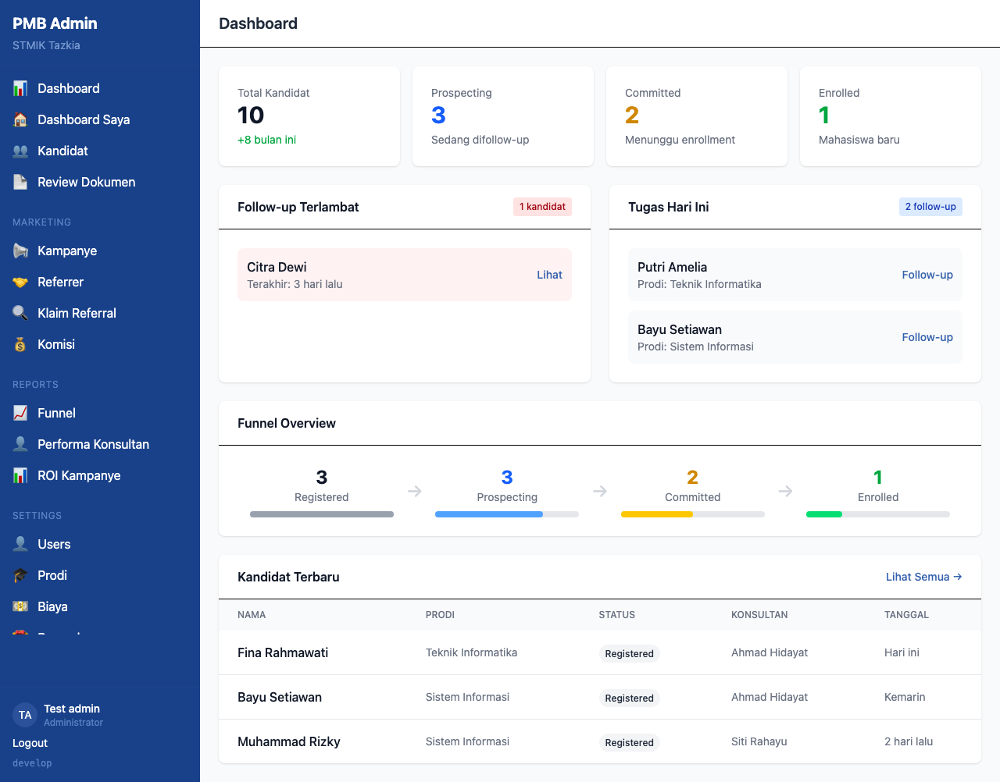

# Panduan Pengguna - Sistem Penerimaan Mahasiswa Baru STMIK Tazkia

Panduan ini menjelaskan cara menggunakan aplikasi Admin CRM untuk mengelola penerimaan mahasiswa baru.

---

## Daftar Isi

1. [Login](#1-login)
2. [Dashboard](#2-dashboard)
3. [Pengaturan Pengguna](#3-pengaturan-pengguna)
4. [Pengaturan Program Studi](#4-pengaturan-program-studi)
5. [Pengaturan Biaya](#5-pengaturan-biaya)
6. [Pengaturan Kategori & Hambatan](#6-pengaturan-kategori--hambatan)
7. [Pengaturan Kampanye](#7-pengaturan-kampanye)
8. [Pengaturan Reward](#8-pengaturan-reward)
9. [Pengaturan Referrer](#9-pengaturan-referrer)
10. [Pengaturan Algoritma Assignment](#10-pengaturan-algoritma-assignment)
11. [Pengaturan Jenis Dokumen](#11-pengaturan-jenis-dokumen)
12. [Pengaturan Alasan Kehilangan](#12-pengaturan-alasan-kehilangan)

---

## 1. Login

Staff menggunakan akun Google dengan email institusi (@tazkia.ac.id) untuk masuk ke sistem.

**Langkah-langkah:**

1. Buka halaman `/admin/login`
2. Klik tombol "Masuk dengan Google"
3. Pilih akun Google dengan email institusi
4. Sistem akan otomatis membuat akun dengan role Konsultan jika belum ada

**Catatan:** Hanya email dengan domain yang terdaftar yang dapat masuk ke sistem.

---

## 2. Dashboard

Setelah login, pengguna akan melihat dashboard dengan ringkasan statistik.

**Informasi yang ditampilkan:**

- Total Kandidat
- Jumlah kandidat Prospecting (sedang difollow-up)
- Jumlah kandidat Committed (menunggu enrollment)
- Jumlah kandidat Enrolled (mahasiswa baru)
- Daftar follow-up yang terlambat
- Aktivitas terbaru

---

## 3. Pengaturan Pengguna

Menu: **Settings > Users**

Halaman ini untuk mengelola akun staff (admin, supervisor, konsultan).

**Fitur:**

- Lihat daftar semua pengguna
- Ubah role pengguna (Admin, Supervisor, Konsultan)
- Tetapkan supervisor untuk konsultan
- Aktifkan/nonaktifkan pengguna

**Role Pengguna:**

| Role | Akses |
|------|-------|
| Admin | Akses penuh ke seluruh sistem |
| Supervisor | Mengelola tim konsultan, memberikan saran |
| Konsultan | Mengelola kandidat yang di-assign |

---

## 4. Pengaturan Program Studi

Menu: **Settings > Programs**

Halaman ini untuk mengelola program studi yang ditawarkan.

**Menambah Program Studi:**

**Field yang diisi:**

| Field | Keterangan |
|-------|------------|
| Nama | Nama lengkap program studi |
| Kode | Kode singkat (contoh: SI, TI) |
| Jenjang | S1 atau D3 |

**Fitur:**

- Tambah program studi baru
- Edit program studi
- Aktifkan/nonaktifkan program studi

---

## 5. Pengaturan Biaya

Menu: **Settings > Fees**

Halaman ini untuk mengatur struktur biaya per program studi dan tahun akademik.

**Menambah Struktur Biaya:**

**Field yang diisi:**

| Field | Keterangan |
|-------|------------|
| Jenis Biaya | Pendaftaran, SPP, atau Asrama |
| Program Studi | Pilih prodi (opsional untuk biaya global) |
| Tahun Akademik | Format: 2025/2026 |
| Nominal | Jumlah dalam Rupiah |

**Jenis Biaya:**

- **Pendaftaran** - Biaya satu kali saat mendaftar
- **SPP** - Biaya per semester
- **Asrama** - Biaya per semester (opsional)

---

## 6. Pengaturan Kategori & Hambatan

Menu: **Settings > Categories**

Halaman ini untuk mengelola kategori interaksi dan hambatan umum yang ditemui saat follow-up.

### Kategori Interaksi

Digunakan untuk mengkategorikan hasil interaksi dengan kandidat.

**Menambah Kategori:**

**Field yang diisi:**

| Field | Keterangan |
|-------|------------|
| Nama | Nama kategori |
| Sentimen | Positif, Netral, atau Negatif |
| Urutan | Urutan tampilan |

**Contoh kategori:**

- Tertarik (positif)
- Mempertimbangkan (netral)
- Ragu-ragu (netral)
- Dingin (negatif)
- Tidak bisa dihubungi (negatif)

### Hambatan

Digunakan untuk mencatat hambatan yang dihadapi kandidat.

**Menambah Hambatan:**

**Field yang diisi:**

| Field | Keterangan |
|-------|------------|
| Nama | Nama hambatan |
| Respon Disarankan | Template jawaban untuk konsultan |
| Urutan | Urutan tampilan |

**Contoh hambatan:**

- Biaya terlalu mahal
- Lokasi jauh
- Orang tua belum setuju
- Waktu belum tepat
- Memilih kampus lain

---

## 7. Pengaturan Kampanye

Menu: **Settings > Campaigns**

Halaman ini untuk mengelola kampanye marketing dan promo.

**Menambah Kampanye:**

**Field yang diisi:**

| Field | Keterangan |
|-------|------------|
| Nama | Nama kampanye |
| Tipe | Promo, Event, atau Ads |
| Channel | Instagram, Google, TikTok, Expo, dll |
| Tanggal Mulai | Tanggal kampanye dimulai |
| Tanggal Selesai | Tanggal kampanye berakhir |
| Override Biaya Daftar | Biaya pendaftaran khusus (kosongkan untuk default) |

**Contoh kampanye:**

- "Promo Early Bird 2026" - biaya pendaftaran Rp 0
- "Education Expo Jakarta" - tracking peserta expo
- "Instagram Ads Q1" - tracking dari iklan Instagram

---

## 8. Pengaturan Reward

Menu: **Settings > Rewards**

Halaman ini untuk mengatur reward/komisi untuk referrer.

### Reward Referrer External

Untuk alumni, guru, siswa, partner, dan staff yang mereferensikan calon mahasiswa.

**Menambah Reward:**

**Field yang diisi:**

| Field | Keterangan |
|-------|------------|
| Tipe Referrer | Alumni, Guru, Siswa, Partner, Staff |
| Tipe Reward | Cash, Potongan SPP, Merchandise |
| Trigger | Kapan reward diberikan |
| Nominal | Jumlah reward |
| Persentase | Centang jika nominal dalam persen |

### Reward Member Get Member (MGM)

Untuk mahasiswa aktif yang mereferensikan calon mahasiswa baru.

**Menambah Reward MGM:**

**Field yang diisi:**

| Field | Keterangan |
|-------|------------|
| Tahun Akademik | Tahun berlaku |
| Tipe Reward | Cash, Potongan SPP, Merchandise |
| Trigger | Kapan reward diberikan |
| Reward Referrer | Nominal untuk mahasiswa yang mereferensikan |
| Diskon Referee | Potongan untuk calon mahasiswa baru |

---

## 9. Pengaturan Referrer

Menu: **Settings > Referrers**

Halaman ini untuk mengelola data referrer yang akan mendapat komisi.

**Menambah Referrer:**

**Field yang diisi:**

| Field | Keterangan |
|-------|------------|
| Nama | Nama lengkap referrer |
| Tipe | Alumni, Guru, Siswa, Partner, Staff |
| Institusi | Asal sekolah/instansi |
| Telepon | Nomor telepon (opsional) |
| Email | Alamat email (opsional) |
| Kode Referral | Kode unik untuk tracking (opsional) |
| Nama Bank | Nama bank untuk transfer |
| No Rekening | Nomor rekening |
| Nama Pemilik | Nama pemilik rekening |
| Override Komisi | Komisi khusus (kosongkan untuk default) |
| Preferensi Bayar | Bulanan atau Per Enrollment |

---

## 10. Pengaturan Algoritma Assignment

Menu: **Settings > Assignment**

Halaman ini untuk memilih algoritma distribusi kandidat baru ke konsultan.

**Pilihan Algoritma:**

| Algoritma | Keterangan |
|-----------|------------|
| Round Robin | Bergantian sesuai urutan |
| Load Balanced | Berdasarkan jumlah kandidat aktif |
| Performance Weighted | Berdasarkan performa konversi |
| Activity Based | Berdasarkan aktivitas follow-up |

**Cara menggunakan:**

- Klik tombol "Aktifkan" pada algoritma yang diinginkan
- Hanya satu algoritma yang aktif pada satu waktu
- Kandidat baru akan otomatis di-assign sesuai algoritma aktif

---

## 11. Pengaturan Jenis Dokumen

Menu: **Settings > Document Types**

Halaman ini untuk mengelola jenis dokumen yang harus diupload kandidat.

**Menambah Jenis Dokumen:**

**Field yang diisi:**

| Field | Keterangan |
|-------|------------|
| Nama | Nama jenis dokumen |
| Kode | Kode singkat |
| Deskripsi | Penjelasan dokumen |
| Wajib | Apakah dokumen wajib diupload |
| Bisa Ditunda | Apakah dokumen bisa menyusul |
| Ukuran Maks (MB) | Batas ukuran file |
| Urutan | Urutan tampilan |

**Contoh jenis dokumen:**

| Dokumen | Wajib | Bisa Ditunda |
|---------|-------|--------------|
| KTP | Ya | Tidak |
| Foto | Ya | Tidak |
| Ijazah | Ya | Ya (untuk yang belum wisuda) |
| Transkrip | Ya | Ya (untuk yang belum wisuda) |

---

## 12. Pengaturan Alasan Kehilangan

Menu: **Settings > Lost Reasons**

Halaman ini untuk mengelola alasan kandidat yang tidak melanjutkan pendaftaran.

**Menambah Alasan:**

**Field yang diisi:**

| Field | Keterangan |
|-------|------------|
| Nama | Nama alasan |
| Deskripsi | Penjelasan detail (opsional) |
| Urutan | Urutan tampilan |

**Contoh alasan:**

- Tidak ada respon
- Memilih kampus lain
- Masalah biaya
- Tidak memenuhi syarat
- Waktu tidak tepat
- Lokasi terlalu jauh
- Orang tua tidak setuju
- Lainnya

---

## Kontak Dukungan

Jika mengalami kendala atau membutuhkan bantuan, silakan hubungi tim IT melalui:

- Email: it@tazkia.ac.id

---

*Dokumentasi ini dihasilkan secara otomatis dari sistem.*
