# Panduan Pengguna - Sistem Penerimaan Mahasiswa Baru STMIK Tazkia

Panduan ini menjelaskan cara menggunakan sistem penerimaan mahasiswa baru STMIK Tazkia, baik untuk calon mahasiswa maupun staff admin.

---

## Daftar Isi

### Portal Calon Mahasiswa
1. [Pendaftaran Akun](#1-pendaftaran-akun)
2. [Login Calon Mahasiswa](#2-login-calon-mahasiswa)
3. [Dashboard Portal](#3-dashboard-portal)
4. [Upload Dokumen](#4-upload-dokumen)
5. [Pembayaran](#5-pembayaran)
6. [Pengumuman](#6-pengumuman)

### Admin CRM - Pengaturan
7. [Login Admin](#7-login-admin)
8. [Pengaturan Pengguna](#8-pengaturan-pengguna)
9. [Pengaturan Program Studi](#9-pengaturan-program-studi)
10. [Pengaturan Biaya](#10-pengaturan-biaya)
11. [Pengaturan Kategori & Hambatan](#11-pengaturan-kategori--hambatan)
12. [Pengaturan Kampanye](#12-pengaturan-kampanye)
13. [Pengaturan Reward](#13-pengaturan-reward)
14. [Pengaturan Referrer](#14-pengaturan-referrer)
15. [Pengaturan Algoritma Assignment](#15-pengaturan-algoritma-assignment)
16. [Pengaturan Jenis Dokumen](#16-pengaturan-jenis-dokumen)
17. [Pengaturan Alasan Kehilangan](#17-pengaturan-alasan-kehilangan)

### Admin CRM - Dashboard & Monitoring
18. [Dashboard Admin](#18-dashboard-admin)
19. [Daftar Kandidat](#19-daftar-kandidat)
20. [Detail Kandidat](#20-detail-kandidat)

### Dashboard Konsultan Akademik (AC)
21. [Dashboard Konsultan](#21-dashboard-konsultan)

### Laporan
22. [Laporan Performa Konsultan](#22-laporan-performa-konsultan)

---

# Portal Calon Mahasiswa

---

## 1. Pendaftaran Akun

Calon mahasiswa dapat mendaftar melalui portal pendaftaran online dengan 4 langkah mudah.

### Langkah 1: Buat Akun

**Field yang diisi:**

| Field | Keterangan |
|-------|------------|
| Email | Alamat email (opsional, minimal isi email atau HP) |
| Nomor HP | Nomor WhatsApp aktif (opsional, minimal isi email atau HP) |
| Password | Minimal 8 karakter |
| Konfirmasi Password | Ulangi password |

**Catatan:** Minimal salah satu dari email atau nomor HP harus diisi.

**Contoh pengisian:**

### Langkah 2: Data Diri

**Field yang diisi:**

| Field | Keterangan |
|-------|------------|
| Nama Lengkap | Sesuai KTP/Ijazah |
| Alamat Lengkap | Jalan, RT/RW, Kelurahan, Kecamatan |
| Kota/Kabupaten | Kota tempat tinggal |
| Provinsi | Provinsi tempat tinggal |

**Contoh pengisian:**

### Langkah 3: Data Pendidikan

**Field yang diisi:**

| Field | Keterangan |
|-------|------------|
| Asal Sekolah | Nama SMA/SMK/MA |
| Tahun Lulus | Tahun kelulusan |
| Program Studi | Pilih program studi yang diminati |

**Contoh pengisian:**

### Langkah 4: Informasi Tambahan

**Field yang diisi:**

| Field | Keterangan |
|-------|------------|
| Sumber Informasi | Dari mana mengetahui STMIK Tazkia |
| Detail | Informasi tambahan (untuk sumber tertentu) |

**Pilihan sumber informasi:**

- Instagram
- Google
- TikTok
- YouTube
- Pameran Pendidikan
- Kunjungan Sekolah
- Teman/Keluarga
- Guru/Alumni
- Datang Langsung
- Lainnya

**Contoh pengisian:**

Setelah selesai, sistem akan otomatis:
- Menugaskan konsultan akademik untuk membantu proses pendaftaran
- Mengarahkan ke dashboard portal

---

## 2. Login Calon Mahasiswa

Calon mahasiswa yang sudah memiliki akun dapat login untuk melanjutkan proses pendaftaran.

**Langkah-langkah:**

1. Buka halaman `/login`
2. Masukkan email atau nomor HP yang terdaftar
3. Masukkan password
4. Klik tombol "Masuk"

**Catatan:** Jika lupa password, hubungi konsultan akademik untuk reset password.

---

## 3. Dashboard Portal

Setelah login, calon mahasiswa akan melihat dashboard dengan informasi pendaftaran.

**Informasi yang ditampilkan:**

- Status pendaftaran (Terdaftar, Dalam Proses, Berkomitmen, Diterima)
- Checklist langkah-langkah pendaftaran
- Pengumuman terbaru
- Informasi konsultan akademik yang ditugaskan
- Menu cepat untuk akses dokumen, pembayaran, dan pengumuman

**Checklist Pendaftaran:**

| Langkah | Keterangan |
|---------|------------|
| Verifikasi Email | Opsional - verifikasi alamat email |
| Verifikasi WhatsApp | Opsional - verifikasi nomor HP |
| Data Diri | Lengkapi informasi pribadi |
| Data Pendidikan | Lengkapi informasi pendidikan |
| Upload Dokumen | Upload dokumen yang diperlukan |
| Pembayaran | Selesaikan pembayaran biaya pendaftaran |

---

## 4. Upload Dokumen

Halaman untuk mengelola dokumen persyaratan pendaftaran.

**Proses Bisnis:**

1. Sistem menampilkan daftar dokumen yang diperlukan beserta statusnya
2. Progress kelengkapan ditampilkan di bagian atas halaman
3. Calon mahasiswa dapat mengupload dokumen satu per satu
4. Setiap dokumen yang diupload akan menunggu verifikasi dari admin

**Status Dokumen:**

| Status | Keterangan |
|--------|------------|
| Belum Upload | Dokumen belum diupload |
| Menunggu Review | Dokumen sudah diupload, menunggu verifikasi admin |
| Disetujui | Dokumen sudah diverifikasi dan diterima |
| Ditolak | Dokumen tidak sesuai, perlu upload ulang |
| Menyusul | Dokumen akan diupload nanti (untuk ijazah yang belum terbit) |

**Dokumen yang Diperlukan:**

| Dokumen | Wajib | Bisa Ditunda |
|---------|-------|--------------|
| KTP | Ya | Tidak |
| Pas Photo | Ya | Tidak |
| Ijazah | Ya | Ya (untuk yang belum wisuda) |
| Transkrip | Ya | Ya (untuk yang belum wisuda) |
| Surat Keterangan Lulus | Tidak | Ya |

**Tips Upload:**
- Pastikan dokumen jelas dan tidak buram
- Foto KTP dan Ijazah harus terlihat seluruh bagiannya
- Gunakan format JPG, PNG, atau PDF
- Ukuran file maksimal 5MB per dokumen
- Untuk foto pas photo, gunakan background merah atau biru

---

## 5. Pembayaran

Halaman untuk mengelola tagihan dan upload bukti pembayaran.

**Proses Bisnis:**

1. Sistem menampilkan ringkasan pembayaran (total tagihan, sudah dibayar, menunggu verifikasi)
2. Informasi rekening pembayaran ditampilkan dengan format berita transfer
3. Daftar tagihan ditampilkan dengan status masing-masing
4. Calon mahasiswa dapat mengupload bukti bayar untuk setiap tagihan

**Alur Pembayaran:**

1. Lihat tagihan yang belum dibayar
2. Transfer ke rekening yang tertera dengan berita transfer sesuai format
3. Klik "Upload Bukti Bayar" pada tagihan yang sudah ditransfer
4. Upload foto/screenshot bukti transfer
5. Tunggu verifikasi dari admin

**Status Pembayaran:**

| Status | Keterangan |
|--------|------------|
| Belum Dibayar | Tagihan belum dibayar |
| Menunggu Verifikasi | Bukti bayar sudah diupload, menunggu verifikasi |
| Lunas | Pembayaran sudah diverifikasi |

---

## 6. Pengumuman

Halaman untuk melihat pengumuman terbaru dari panitia PMB.

**Proses Bisnis:**

1. Pengumuman ditampilkan dalam bentuk daftar dengan urutan terbaru di atas
2. Setiap pengumuman menampilkan judul, tanggal, dan ringkasan isi
3. Klik pada pengumuman untuk melihat detail lengkap
4. Pengumuman penting ditandai dengan badge khusus

**Jenis Pengumuman:**

| Jenis | Keterangan |
|-------|------------|
| Informasi | Pengumuman umum tentang proses PMB |
| Jadwal | Jadwal kegiatan seperti tes, wawancara, daftar ulang |
| Penting | Pengumuman yang memerlukan tindakan segera |

---

# Admin CRM - Pengaturan

---

## 7. Login Admin

Staff menggunakan akun Google dengan email institusi (@tazkia.ac.id) untuk masuk ke sistem.

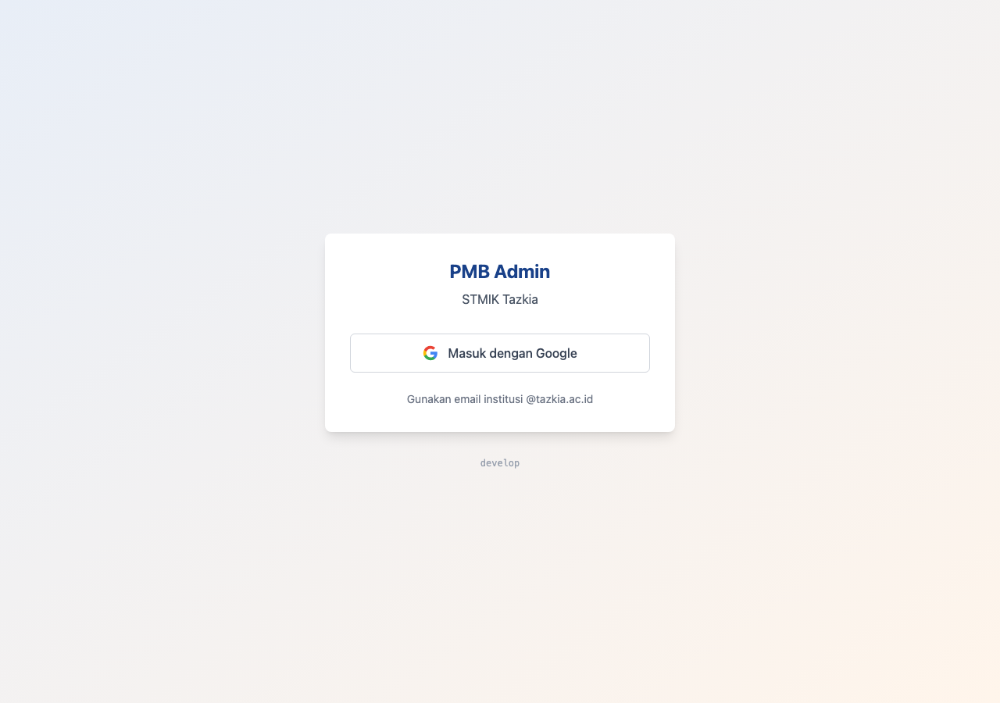

**Langkah-langkah:**

1. Buka halaman `/admin/login`
2. Klik tombol "Masuk dengan Google"
3. Pilih akun Google dengan email institusi
4. Sistem akan otomatis membuat akun dengan role Konsultan jika belum ada

**Catatan:** Hanya email dengan domain yang terdaftar yang dapat masuk ke sistem.

---

## 8. Pengaturan Pengguna

Menu: **Settings > Users**

Halaman ini untuk mengelola akun staff (admin, supervisor, konsultan).

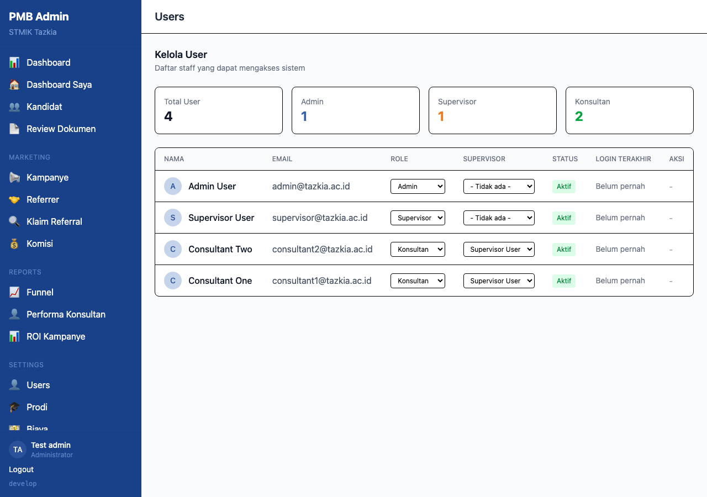

**Fitur:**

- Lihat daftar semua pengguna
- Ubah role pengguna (Admin, Supervisor, Konsultan)
- Tetapkan supervisor untuk konsultan
- Aktifkan/nonaktifkan pengguna

**Role Pengguna:**

| Role | Akses |
|------|-------|
| Admin | Akses penuh ke seluruh sistem |
| Supervisor | Mengelola tim konsultan, memberikan saran |
| Konsultan | Mengelola kandidat yang di-assign |

---

## 9. Pengaturan Program Studi

Menu: **Settings > Programs**

Halaman ini untuk mengelola program studi yang ditawarkan.

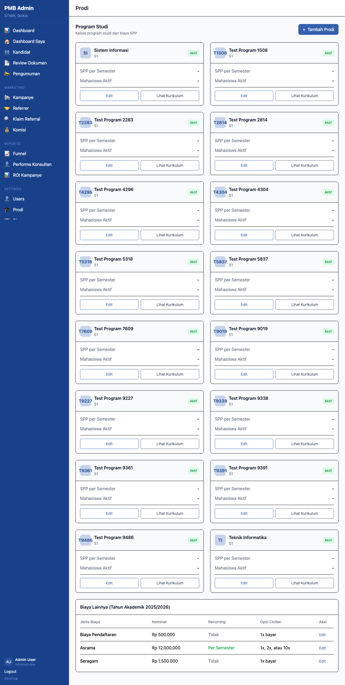

**Menambah Program Studi:**

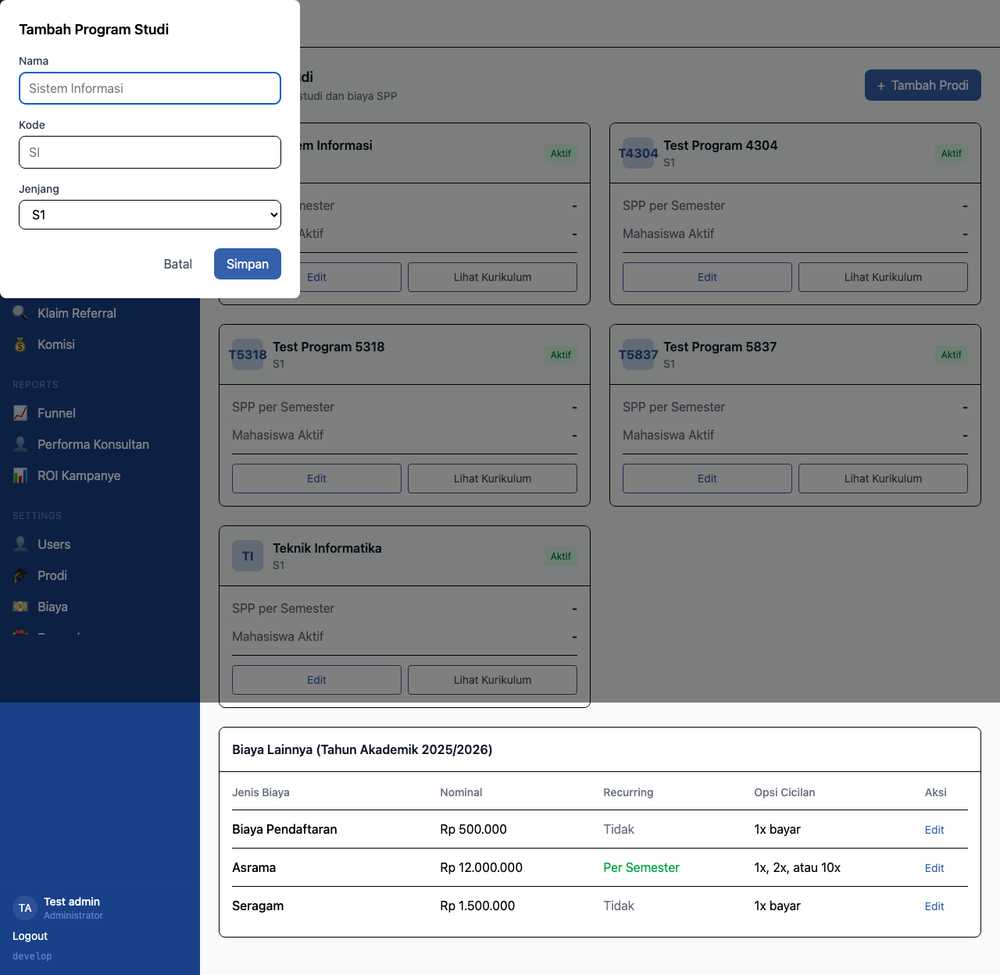

**Field yang diisi:**

| Field | Keterangan |
|-------|------------|
| Nama | Nama lengkap program studi |
| Kode | Kode singkat (contoh: SI, TI) |
| Jenjang | S1 atau D3 |

**Fitur:**

- Tambah program studi baru
- Edit program studi
- Aktifkan/nonaktifkan program studi

---

## 10. Pengaturan Biaya

Menu: **Settings > Fees**

Halaman ini untuk mengatur struktur biaya per program studi dan tahun akademik.

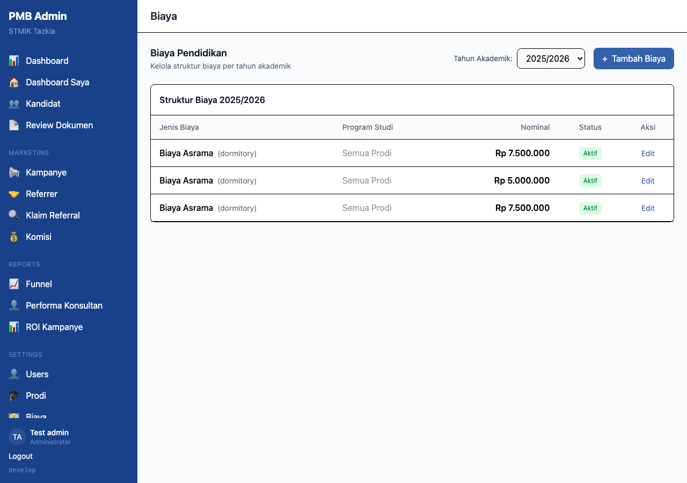

**Menambah Struktur Biaya:**

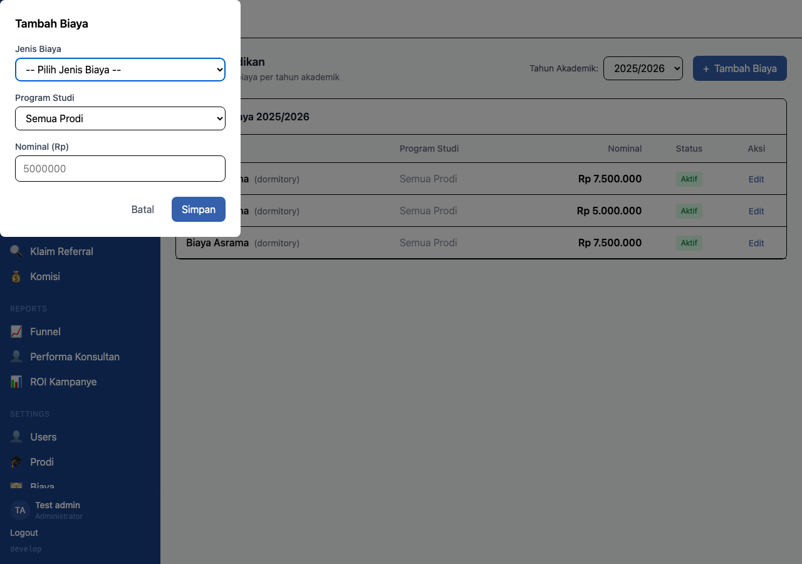

**Field yang diisi:**

| Field | Keterangan |
|-------|------------|
| Jenis Biaya | Pendaftaran, SPP, atau Asrama |
| Program Studi | Pilih prodi (opsional untuk biaya global) |
| Tahun Akademik | Format: 2025/2026 |
| Nominal | Jumlah dalam Rupiah |

**Jenis Biaya:**

- **Pendaftaran** - Biaya satu kali saat mendaftar
- **SPP** - Biaya per semester
- **Asrama** - Biaya per semester (opsional)

---

## 11. Pengaturan Kategori & Hambatan

Menu: **Settings > Categories**

Halaman ini untuk mengelola kategori interaksi dan hambatan umum yang ditemui saat follow-up.

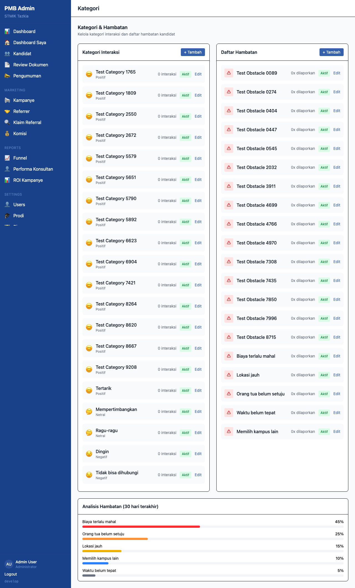

### Kategori Interaksi

Digunakan untuk mengkategorikan hasil interaksi dengan kandidat.

**Menambah Kategori:**

**Field yang diisi:**

| Field | Keterangan |
|-------|------------|
| Nama | Nama kategori |
| Sentimen | Positif, Netral, atau Negatif |
| Urutan | Urutan tampilan |

**Contoh kategori:**

- Tertarik (positif)
- Mempertimbangkan (netral)
- Ragu-ragu (netral)
- Dingin (negatif)
- Tidak bisa dihubungi (negatif)

### Hambatan

Digunakan untuk mencatat hambatan yang dihadapi kandidat.

**Menambah Hambatan:**

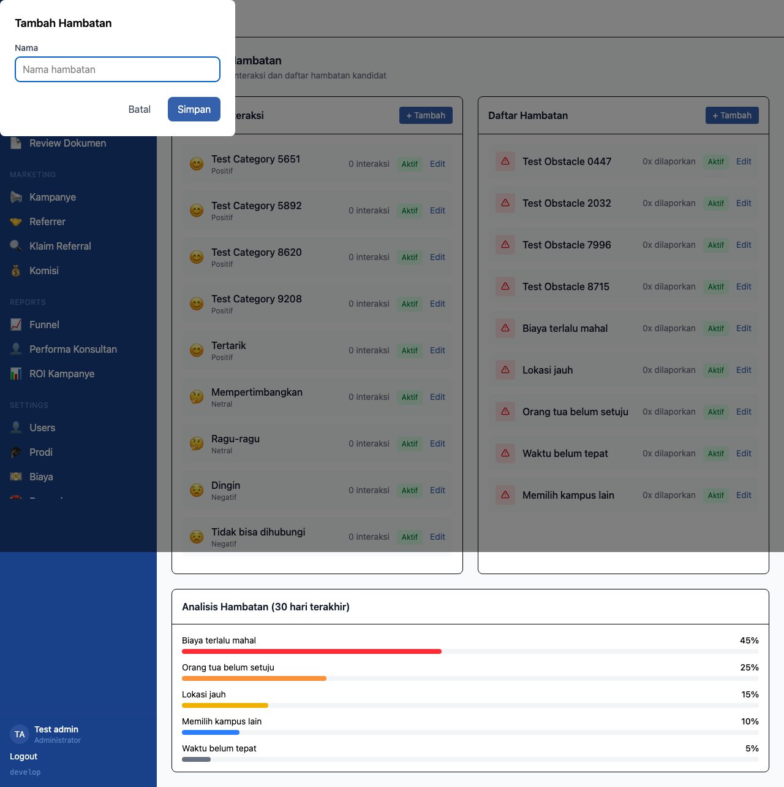

**Field yang diisi:**

| Field | Keterangan |
|-------|------------|
| Nama | Nama hambatan |
| Respon Disarankan | Template jawaban untuk konsultan |
| Urutan | Urutan tampilan |

**Contoh hambatan:**

- Biaya terlalu mahal
- Lokasi jauh
- Orang tua belum setuju
- Waktu belum tepat
- Memilih kampus lain

---

## 12. Pengaturan Kampanye

Menu: **Settings > Campaigns**

Halaman ini untuk mengelola kampanye marketing dan promo.

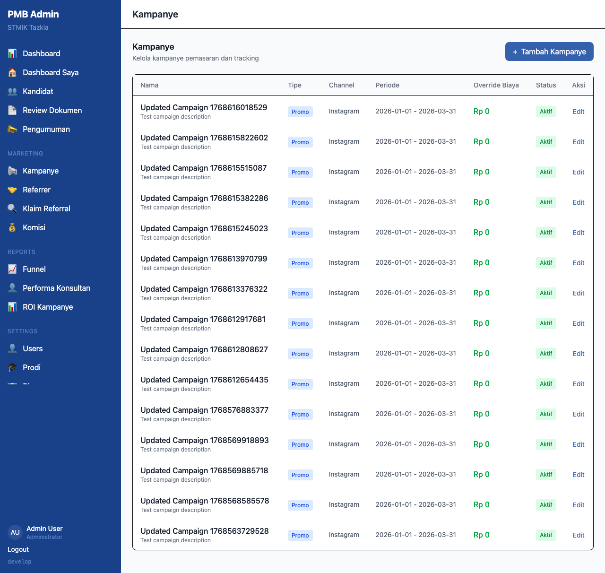

**Menambah Kampanye:**

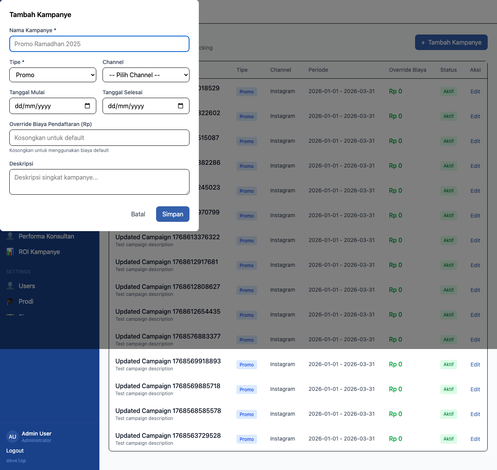

**Field yang diisi:**

| Field | Keterangan |
|-------|------------|
| Nama | Nama kampanye |
| Tipe | Promo, Event, atau Ads |
| Channel | Instagram, Google, TikTok, Expo, dll |
| Tanggal Mulai | Tanggal kampanye dimulai |
| Tanggal Selesai | Tanggal kampanye berakhir |
| Override Biaya Daftar | Biaya pendaftaran khusus (kosongkan untuk default) |

**Contoh kampanye:**

- "Promo Early Bird 2026" - biaya pendaftaran Rp 0
- "Education Expo Jakarta" - tracking peserta expo
- "Instagram Ads Q1" - tracking dari iklan Instagram

---

## 13. Pengaturan Reward

Menu: **Settings > Rewards**

Halaman ini untuk mengatur reward/komisi untuk referrer.

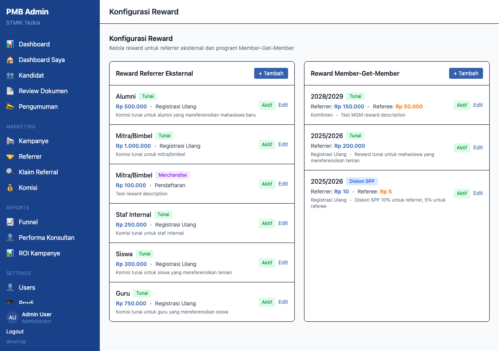

### Reward Referrer External

Untuk alumni, guru, siswa, partner, dan staff yang mereferensikan calon mahasiswa.

**Menambah Reward:**

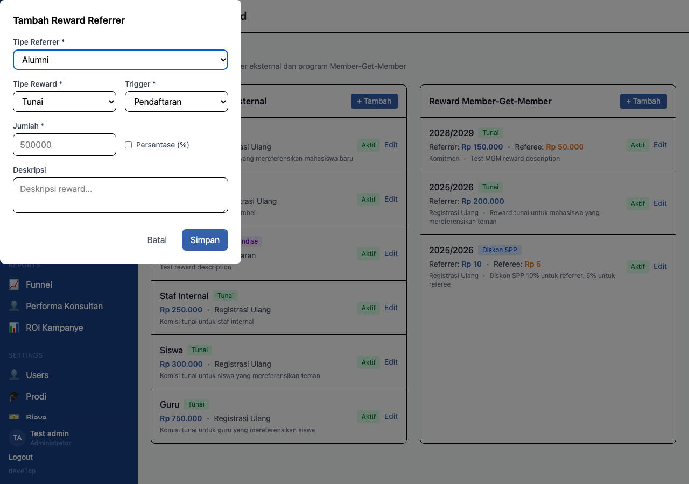

**Field yang diisi:**

| Field | Keterangan |
|-------|------------|
| Tipe Referrer | Alumni, Guru, Siswa, Partner, Staff |
| Tipe Reward | Cash, Potongan SPP, Merchandise |
| Trigger | Kapan reward diberikan |
| Nominal | Jumlah reward |
| Persentase | Centang jika nominal dalam persen |

### Reward Member Get Member (MGM)

Untuk mahasiswa aktif yang mereferensikan calon mahasiswa baru.

**Menambah Reward MGM:**

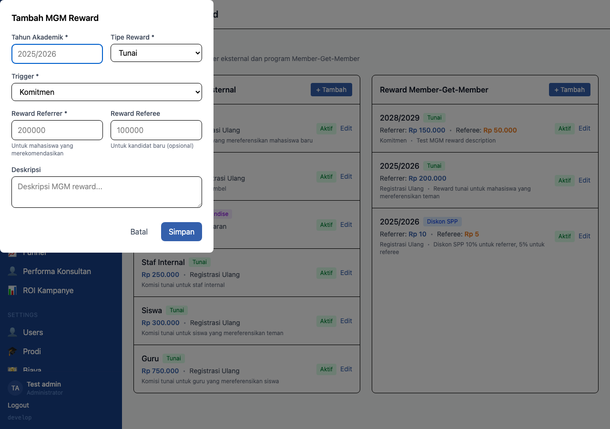

**Field yang diisi:**

| Field | Keterangan |
|-------|------------|
| Tahun Akademik | Tahun berlaku |
| Tipe Reward | Cash, Potongan SPP, Merchandise |
| Trigger | Kapan reward diberikan |
| Reward Referrer | Nominal untuk mahasiswa yang mereferensikan |
| Diskon Referee | Potongan untuk calon mahasiswa baru |

---

## 14. Pengaturan Referrer

Menu: **Settings > Referrers**

Halaman ini untuk mengelola data referrer yang akan mendapat komisi.

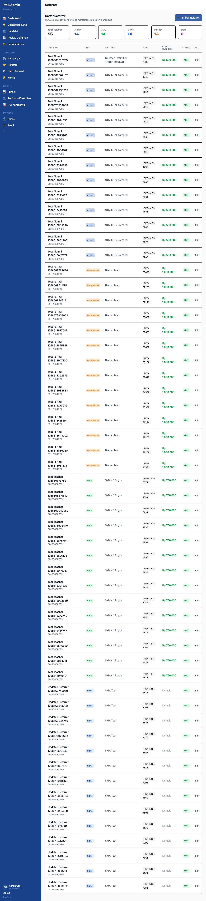

**Menambah Referrer:**

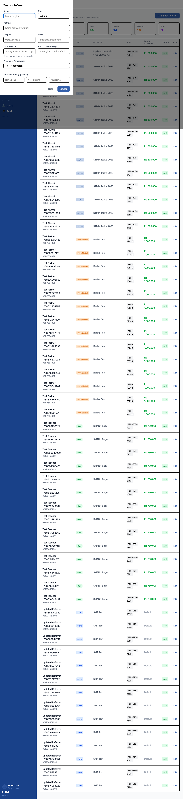

**Field yang diisi:**

| Field | Keterangan |
|-------|------------|
| Nama | Nama lengkap referrer |
| Tipe | Alumni, Guru, Siswa, Partner, Staff |
| Institusi | Asal sekolah/instansi |
| Telepon | Nomor telepon (opsional) |
| Email | Alamat email (opsional) |
| Kode Referral | Kode unik untuk tracking (opsional) |
| Nama Bank | Nama bank untuk transfer |
| No Rekening | Nomor rekening |
| Nama Pemilik | Nama pemilik rekening |
| Override Komisi | Komisi khusus (kosongkan untuk default) |
| Preferensi Bayar | Bulanan atau Per Enrollment |

---

## 15. Pengaturan Algoritma Assignment

Menu: **Settings > Assignment**

Halaman ini untuk memilih algoritma distribusi kandidat baru ke konsultan.

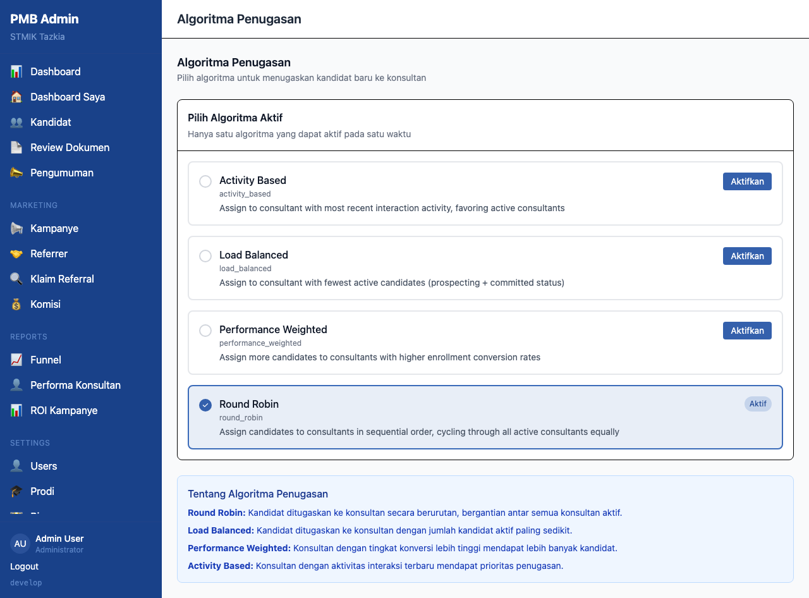

**Pilihan Algoritma:**

| Algoritma | Keterangan |
|-----------|------------|
| Round Robin | Bergantian sesuai urutan |
| Load Balanced | Berdasarkan jumlah kandidat aktif |
| Performance Weighted | Berdasarkan performa konversi |
| Activity Based | Berdasarkan aktivitas follow-up |

**Cara menggunakan:**

- Klik tombol "Aktifkan" pada algoritma yang diinginkan
- Hanya satu algoritma yang aktif pada satu waktu
- Kandidat baru akan otomatis di-assign sesuai algoritma aktif

---

## 16. Pengaturan Jenis Dokumen

Menu: **Settings > Document Types**

Halaman ini untuk mengelola jenis dokumen yang harus diupload kandidat.

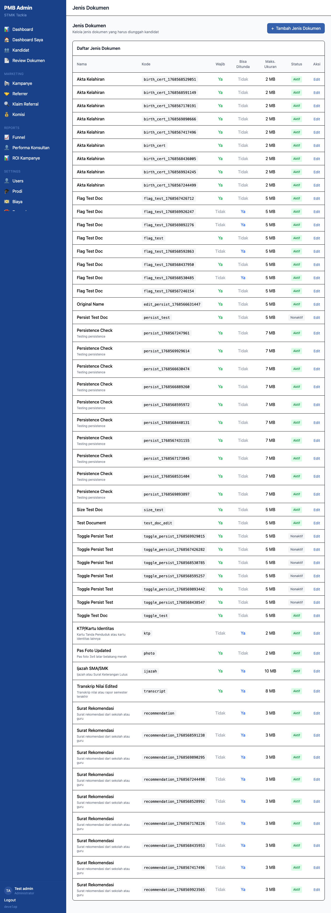

**Menambah Jenis Dokumen:**

**Field yang diisi:**

| Field | Keterangan |
|-------|------------|
| Nama | Nama jenis dokumen |
| Kode | Kode singkat |
| Deskripsi | Penjelasan dokumen |
| Wajib | Apakah dokumen wajib diupload |
| Bisa Ditunda | Apakah dokumen bisa menyusul |
| Ukuran Maks (MB) | Batas ukuran file |
| Urutan | Urutan tampilan |

**Contoh jenis dokumen:**

| Dokumen | Wajib | Bisa Ditunda |
|---------|-------|--------------|
| KTP | Ya | Tidak |
| Foto | Ya | Tidak |
| Ijazah | Ya | Ya (untuk yang belum wisuda) |
| Transkrip | Ya | Ya (untuk yang belum wisuda) |

---

## 17. Pengaturan Alasan Kehilangan

Menu: **Settings > Lost Reasons**

Halaman ini untuk mengelola alasan kandidat yang tidak melanjutkan pendaftaran.

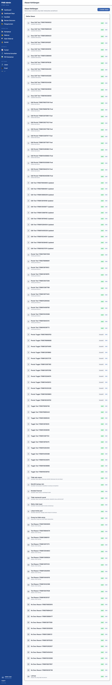

**Menambah Alasan:**

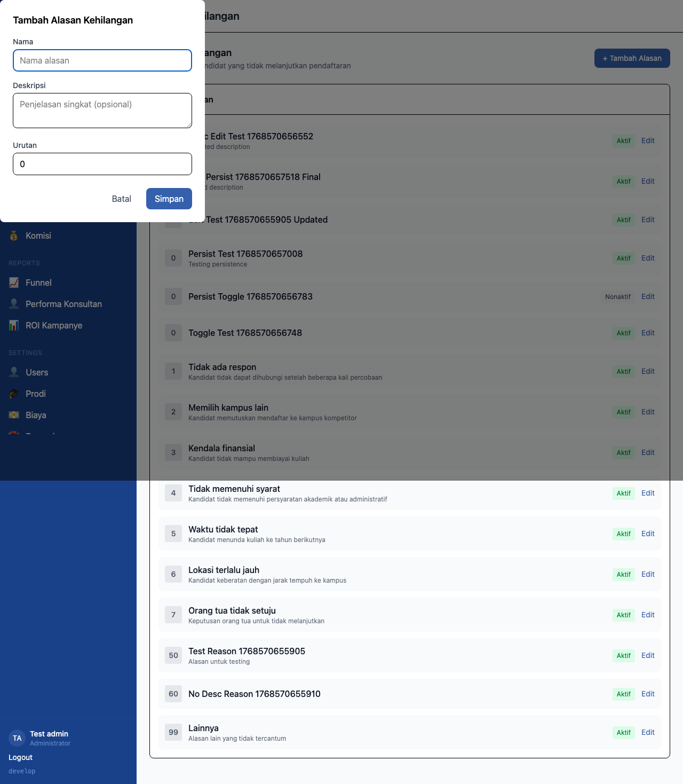

**Field yang diisi:**

| Field | Keterangan |
|-------|------------|
| Nama | Nama alasan |
| Deskripsi | Penjelasan detail (opsional) |
| Urutan | Urutan tampilan |

**Contoh alasan:**

- Tidak ada respon
- Memilih kampus lain
- Masalah biaya
- Tidak memenuhi syarat
- Waktu tidak tepat
- Lokasi terlalu jauh
- Orang tua tidak setuju
- Lainnya

---

# Admin CRM - Dashboard & Monitoring

---

## 18. Dashboard Admin

Menu: **Dashboard**

Dashboard utama admin menampilkan ringkasan statistik dan aktivitas terkini.

### 18.1 Statistik Utama

**Informasi yang ditampilkan:**

| Metrik | Keterangan |
|--------|------------|
| Total Kandidat | Jumlah seluruh kandidat yang terdaftar |
| Prospecting | Kandidat yang sedang difollow-up |
| Committed | Kandidat yang sudah berkomitmen mendaftar |
| Enrolled | Kandidat yang sudah menjadi mahasiswa |

### 18.2 Follow-up yang Terlambat

**Proses Bisnis:**

1. Sistem menampilkan daftar kandidat yang sudah lewat jadwal follow-up
2. Diurutkan berdasarkan yang paling lama terlambat
3. Admin/supervisor dapat melihat kandidat mana yang perlu segera dihubungi
4. Klik nama kandidat untuk melihat detail dan melakukan follow-up

### 18.3 Tugas Hari Ini

**Informasi yang ditampilkan:**

- Daftar kandidat yang dijadwalkan untuk follow-up hari ini
- Prioritas berdasarkan waktu yang dijadwalkan
- Status terakhir interaksi dengan kandidat

### 18.4 Funnel Konversi

**Proses Bisnis:**

1. Menampilkan visualisasi jumlah kandidat di setiap tahap
2. Membantu mengidentifikasi bottleneck dalam proses konversi
3. Persentase konversi antar tahap ditampilkan

**Tahapan Funnel:**

| Tahap | Keterangan |
|-------|------------|
| Registered | Baru mendaftar |
| Prospecting | Sedang difollow-up |
| Committed | Sudah berkomitmen |
| Enrolled | Sudah menjadi mahasiswa |
| Lost | Tidak melanjutkan |

### 18.5 Kandidat Terbaru

**Informasi yang ditampilkan:**

- 10 kandidat terbaru yang mendaftar
- Nama, program studi, dan tanggal pendaftaran
- Status saat ini
- Konsultan yang menangani

---

## 19. Daftar Kandidat

Menu: **Candidates**

Halaman untuk mengelola seluruh kandidat dalam sistem.

### 19.1 Statistik Kandidat

**Informasi yang ditampilkan:**

- Total kandidat
- Breakdown per status
- Persentase masing-masing status

### 19.2 Filter Kandidat

**Opsi Filter:**

| Filter | Keterangan |
|--------|------------|
| Status | Filter berdasarkan status kandidat |
| Konsultan | Filter berdasarkan konsultan yang menangani |
| Program Studi | Filter berdasarkan prodi pilihan |
| Tanggal | Filter berdasarkan tanggal pendaftaran |

**Contoh penggunaan filter status:**

### 19.3 Pencarian Kandidat

**Fitur Pencarian:**

- Cari berdasarkan nama
- Cari berdasarkan email
- Cari berdasarkan nomor HP
- Hasil pencarian real-time

### 19.4 Tabel Kandidat

**Kolom yang ditampilkan:**

| Kolom | Keterangan |
|-------|------------|
| Nama | Nama lengkap kandidat |
| Email/HP | Kontak kandidat |
| Program Studi | Prodi pilihan |
| Status | Status saat ini |
| Konsultan | AC yang menangani |
| Terakhir Follow-up | Tanggal follow-up terakhir |
| Aksi | Tombol untuk detail |

---

## 20. Detail Kandidat

Halaman detail untuk mengelola informasi dan interaksi dengan kandidat.

### 20.1 Header Kandidat

**Informasi yang ditampilkan:**

- Nama kandidat
- Status saat ini dengan badge warna
- Tombol aksi cepat (hubungi, catat interaksi, ubah status)

### 20.2 Data Pribadi

**Informasi yang ditampilkan:**

| Field | Keterangan |
|-------|------------|
| Nama Lengkap | Nama sesuai KTP |
| Email | Alamat email |
| No HP | Nomor WhatsApp |
| Alamat | Alamat lengkap |
| Kota | Kota/Kabupaten |
| Provinsi | Provinsi |

### 20.3 Data Pendidikan

**Informasi yang ditampilkan:**

| Field | Keterangan |
|-------|------------|
| Asal Sekolah | Nama SMA/SMK/MA |
| Tahun Lulus | Tahun kelulusan |
| Program Studi | Prodi yang dipilih |

### 20.4 Sumber & Assignment

**Informasi yang ditampilkan:**

| Field | Keterangan |
|-------|------------|
| Sumber | Dari mana mengetahui STMIK Tazkia |
| Referrer | Siapa yang mereferensikan (jika ada) |
| Kampanye | Kampanye yang diikuti (jika ada) |
| Konsultan | AC yang menangani |
| Tanggal Assign | Tanggal ditugaskan ke konsultan |

### 20.5 Timeline Interaksi

**Proses Bisnis:**

1. Menampilkan riwayat semua interaksi dengan kandidat
2. Urutan dari yang terbaru di atas
3. Setiap entry menampilkan tanggal, jenis interaksi, catatan, dan konsultan
4. Icon berbeda untuk jenis interaksi berbeda (telepon, WhatsApp, email, tatap muka)

### 20.6 Form Catat Interaksi

**Field yang diisi:**

| Field | Keterangan |
|-------|------------|
| Jenis Interaksi | Telepon, WhatsApp, Email, Tatap Muka |
| Kategori Respon | Hasil interaksi (Tertarik, Ragu, dll) |
| Hambatan | Hambatan yang disampaikan kandidat (jika ada) |
| Catatan | Detail percakapan |
| Jadwal Follow-up | Tanggal follow-up berikutnya |

**Proses Bisnis:**

1. Klik tombol "Catat Interaksi" di header
2. Pilih jenis interaksi (telepon/WA/email/tatap muka)
3. Pilih kategori respon dari dropdown
4. Pilih hambatan jika kandidat menyampaikan keberatan
5. Tulis catatan detail percakapan
6. Tentukan jadwal follow-up berikutnya
7. Klik "Simpan" untuk menyimpan

---

# Dashboard Konsultan Akademik (AC)

---

## 21. Dashboard Konsultan

Menu: **My Dashboard**

Dashboard personal untuk konsultan akademik menampilkan kandidat yang ditangani dan tugas harian.

### 21.1 Sambutan & Ringkasan

**Informasi yang ditampilkan:**

- Sapaan personal dengan nama konsultan
- Ringkasan kandidat yang ditangani
- Quick stats performa bulan ini

### 21.2 Statistik Personal

**Metrik yang ditampilkan:**

| Metrik | Keterangan |
|--------|------------|
| Total Kandidat | Jumlah kandidat yang di-handle |
| Prospecting | Kandidat sedang difollow-up |
| Committed | Kandidat yang sudah berkomitmen |
| Enrolled | Kandidat yang berhasil didaftarkan |

### 21.3 Follow-up yang Terlambat

**Proses Bisnis:**

1. Menampilkan kandidat yang sudah melewati jadwal follow-up
2. Diurutkan berdasarkan yang paling lama terlambat
3. Klik untuk langsung membuka detail kandidat
4. Badge merah menunjukkan jumlah hari keterlambatan

### 21.4 Tugas Hari Ini

**Informasi yang ditampilkan:**

- Daftar kandidat yang harus difollow-up hari ini
- Jam yang dijadwalkan
- Status interaksi terakhir
- Tombol cepat untuk menghubungi

### 21.5 Saran dari Supervisor

**Proses Bisnis:**

1. Supervisor memberikan saran untuk kandidat tertentu
2. Saran muncul di dashboard konsultan
3. Konsultan dapat melihat konteks dan rekomendasi aksi
4. Klik "Selesai" setelah mengikuti saran

**Jenis Saran:**

| Jenis | Keterangan |
|-------|------------|
| Follow-up | Saran untuk segera menghubungi kandidat |
| Strategi | Saran pendekatan untuk kandidat tertentu |
| Eskalasi | Kandidat perlu ditangani supervisor |

### 21.6 Performa Bulanan

**Metrik yang ditampilkan:**

- Jumlah kandidat baru bulan ini
- Jumlah enrolled bulan ini
- Rasio konversi
- Perbandingan dengan bulan sebelumnya

---

# Laporan

---

## 22. Laporan Performa Konsultan

Menu: **Reports > Consultant Performance**

Laporan untuk mengevaluasi performa setiap konsultan akademik.

### 22.1 Filter Laporan

**Opsi Filter:**

| Filter | Keterangan |
|--------|------------|
| Periode | Pilih rentang tanggal |
| Konsultan | Filter konsultan tertentu atau semua |
| Tim | Filter berdasarkan tim supervisor |

### 22.2 Ringkasan Performa

**Metrik yang ditampilkan:**

| Metrik | Keterangan |
|--------|------------|
| Total Kandidat | Jumlah kandidat yang ditangani |
| Enrolled | Jumlah yang berhasil menjadi mahasiswa |
| Konversi Rate | Persentase keberhasilan konversi |
| Avg Response Time | Rata-rata waktu respons ke kandidat baru |
| Follow-up Rate | Persentase follow-up tepat waktu |

**Tabel Perbandingan Konsultan:**

| Kolom | Keterangan |
|-------|------------|
| Nama Konsultan | Nama AC |
| Kandidat Aktif | Jumlah kandidat yang sedang ditangani |
| Enrolled Bulan Ini | Jumlah enrolled periode ini |
| Conversion Rate | Tingkat konversi |
| Overdue | Jumlah follow-up terlambat |
| Rating | Skor performa keseluruhan |

**Proses Bisnis:**

1. Pilih periode yang ingin dilihat
2. Sistem menampilkan performa semua konsultan
3. Klik nama konsultan untuk melihat detail
4. Export ke Excel untuk analisis lebih lanjut

---

## Kontak Dukungan

Jika mengalami kendala atau membutuhkan bantuan, silakan hubungi tim IT melalui:

- Email: it@tazkia.ac.id

---

*Dokumentasi ini dihasilkan secara otomatis dari sistem.*
