# Campus Website - Technical Architecture

## Table of Contents
- [Architecture Pattern](#architecture-pattern)
- [Technology Stack](#technology-stack)
- [Authentication System](#authentication-system)
- [Authentication Flows](#authentication-flows)
- [Database Schema](#database-schema)
- [Session Management](#session-management)
- [BFF Traffic Analysis](#bff-traffic-analysis)
- [DDoS Protection & Cost Safety](#ddos-protection--cost-safety)
- [Security Considerations](#security-considerations)
- [Scalability](#scalability)

---

## Architecture Pattern

**Hybrid Static Site + BFF (Backend-For-Frontend) Pattern**

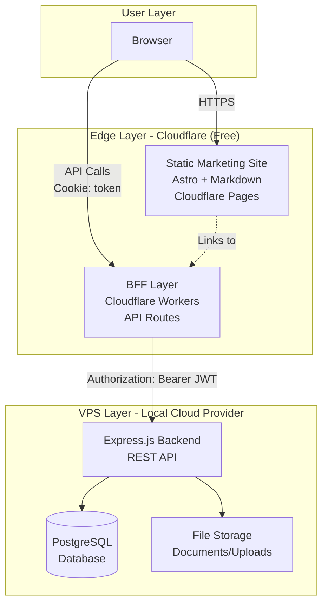

###  Key Architectural Decisions

**Why BFF Pattern?**
1. **Security**: HttpOnly cookies prevent XSS attacks
2. **Token Management**: BFF handles token extraction and forwarding
3. **API Aggregation**: Can combine multiple backend calls in future
4. **Rate Limiting**: Edge-level protection via Cloudflare
5. **CORS Simplification**: Same-origin requests from browser

**Why Static Site Generation?**
1. **Performance**: Pre-rendered HTML served from global CDN
2. **SEO**: Excellent crawlability for marketing pages
3. **Cost**: Unlimited bandwidth on Cloudflare Pages
4. **Developer Experience**: Markdown-based content management
5. **Git-based Workflow**: Version control for content

**Why Serverless for BFF?**
1. **Zero Cost**: Cloudflare Workers free tier (100k req/day)
2. **Global Distribution**: Runs at edge, low latency
3. **Auto-scaling**: No infrastructure management
4. **DDoS Protection**: Built-in hard limits

---

## Technology Stack

| Component | Technology | Hosting | Cost |
|-----------|-----------|---------|------|
| **Static Site** | Astro + Markdown | Cloudflare Pages | Free |
| **BFF Layer** | Cloudflare Workers | Cloudflare | Free (100k req/day) |
| **Backend API** | Express.js (Node.js) | Local VPS Provider | $5-10/mo |
| **Database** | PostgreSQL | Local VPS Provider | Included in VPS |
| **File Storage** | Cloudflare R2 / VPS | Cloudflare / VPS | Free tier / Included |
| **Build/Deploy** | GitHub Actions | GitHub | Free |

**Total Monthly Cost: $5-10** (VPS only)

### Technology Rationale

**Frontend: Astro**
- Static site generation for marketing pages
- Server-side rendering capability for dynamic pages
- Excellent performance (minimal JavaScript)
- MDX support for rich content
- Component islands architecture

**BFF: Cloudflare Workers**
- Edge computing for low latency
- JavaScript/TypeScript runtime
- Built-in KV storage for caching
- Generous free tier
- Global distribution

**Backend: Express.js**
- Mature, battle-tested framework
- Large ecosystem of middleware
- Easy to understand and maintain
- Your 20+ years of experience applicable
- Good PostgreSQL integration

**Database: PostgreSQL**
- ACID compliance for critical data
- JSON support for flexible schemas
- Excellent performance
- Strong community support
- Free and open source

---

## Authentication System

### Hybrid OIDC + Traditional Authentication

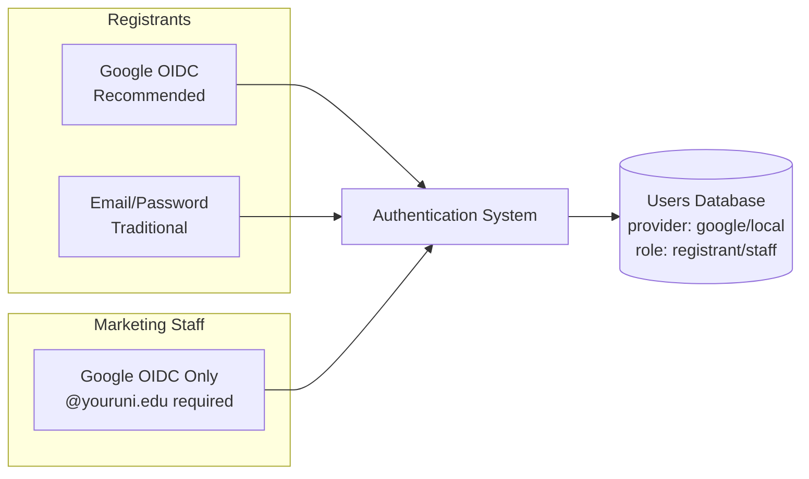

### Authentication Methods

#### Registrants (Prospective Students):
- **Option 1: Google OIDC** (recommended)
  - One-click login
  - No password management
  - Email automatically verified
  - Leverages Google's 2FA
- **Option 2: Email/Password** (traditional)
  - Privacy-conscious option
  - Self-managed credentials
  - Requires email verification
  - Password reset flow needed

#### Marketing Staff:
- **Google OIDC only**
- Enforced via `@youruni.edu` email domain check
- Automatically assigned `staff` role
- Leverages institutional Google Workspace

### Security Features
- ✅ HttpOnly cookies (XSS protection)
- ✅ JWT tokens managed by BFF layer
- ✅ Tokens never exposed to client JavaScript
- ✅ Same-origin requests (no CORS issues)
- ✅ Rate limiting built-in (Cloudflare)
- ✅ DDoS protection included
- ✅ bcrypt password hashing (10 salt rounds)
- ✅ JWT expiration (7 days)
- ✅ SQL injection prevention (parameterized queries)

---

## Authentication Flows

### Google OIDC Authentication Flow

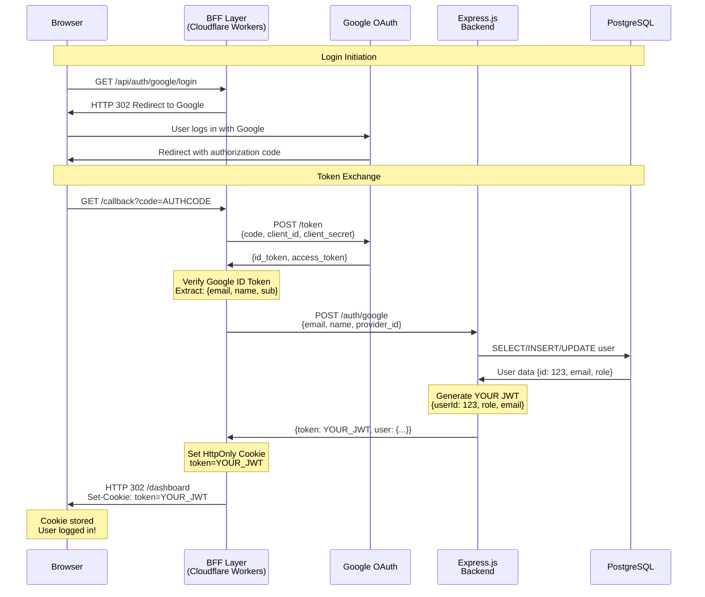

### Traditional Email/Password Flow

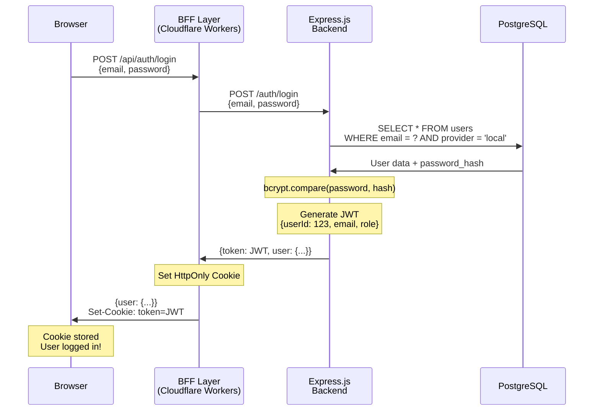

### Authenticated Request Flow

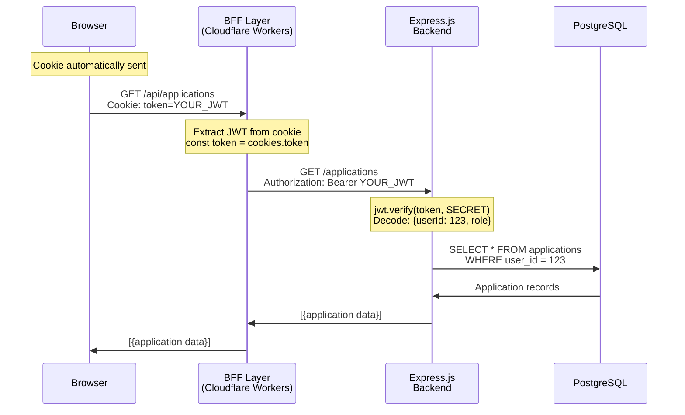

---

## Session Identification: Two Token Pattern

### Token 1: Google's ID Token (OIDC)
**Used only during login, then discarded**

| Property | Value |
|----------|-------|
| **Issued by** | Google |
| **Signed with** | Google's private key |
| **Verified by** | BFF (using Google's public cert) |
| **Contains** | `sub` (Google user ID), `email`, `name`, `iss`, `aud` |
| **Purpose** | Prove user identity to BFF |
| **Lifetime** | 1 hour (but only used once) |
| **Stored** | NOWHERE (discarded after verification) |

### Token 2: Your Backend's JWT
**Used for all authenticated requests**

| Property | Value |
|----------|-------|
| **Issued by** | YOUR Express.js backend |
| **Signed with** | YOUR `JWT_SECRET` |
| **Verified by** | YOUR backend |
| **Contains** | `userId` (your DB ID), `email`, `role`, `provider` |
| **Purpose** | Session management for all API requests |
| **Lifetime** | 7 days |
| **Stored** | HttpOnly cookie (managed by BFF) |

### Flow Summary

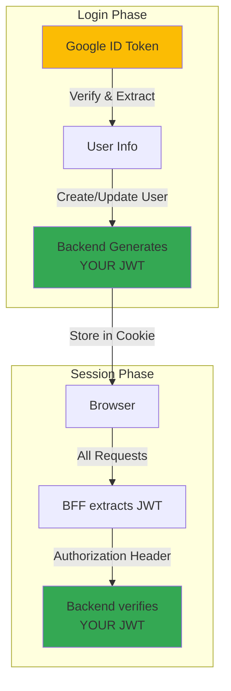

**Key Insight:**
- **OIDC is for AUTHENTICATION** (proving who you are during login)
- **YOUR JWT is for AUTHORIZATION** (accessing resources after login)

---

## Database Schema

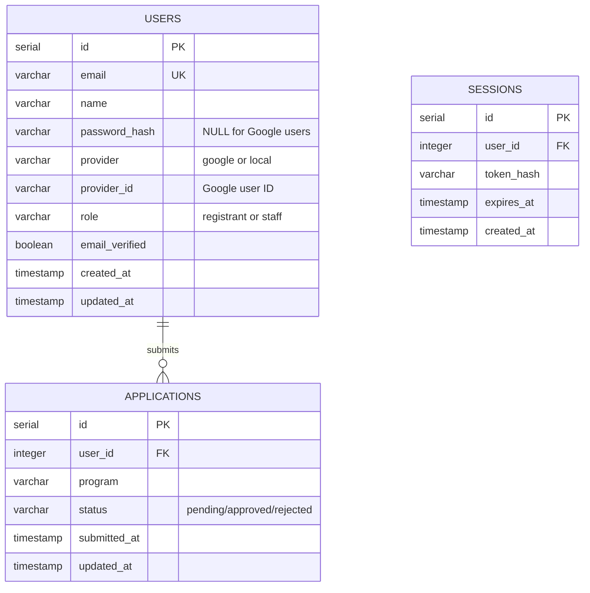

### Table Descriptions

**USERS Table**
- Stores both local and Google OAuth users
- `provider` field determines authentication method
- `password_hash` is NULL for Google users
- `provider_id` stores Google's unique user ID
- `role` determines access level (registrant/staff)

**APPLICATIONS Table**
- One-to-many relationship with USERS
- `status` enum: pending, approved, rejected
- Additional fields can include: program, documents, etc.

**SESSIONS Table** (Optional - for Option B session management)
- Tracks active sessions
- Enables "logout from all devices" feature
- Can store additional metadata

---

## Session Management

### Option A: Backend JWT (Current Design - Recommended)

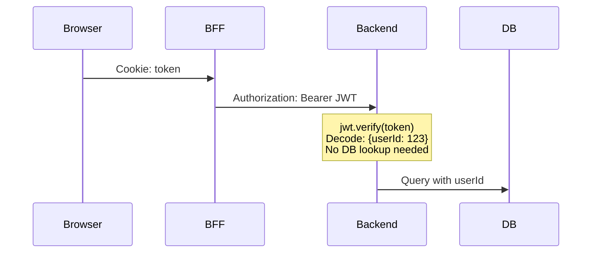

**Pros:**
- ✅ Simple implementation
- ✅ Stateless backend (easy scaling)
- ✅ Fast (no session lookup)
- ✅ Good for <5,000 users

**Cons:**
- ⚠️ Can't revoke sessions immediately
- ⚠️ Token refresh requires new flow

### Option B: BFF Session + Backend JWT (Advanced)

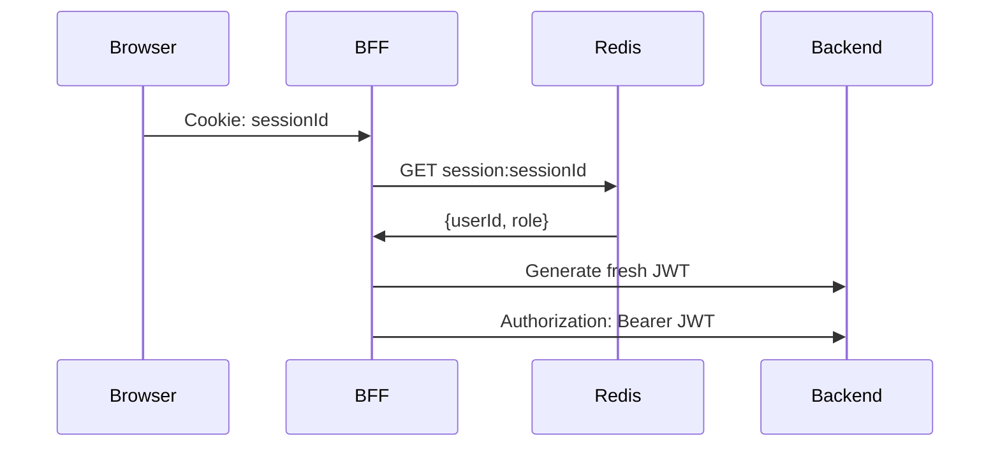

**Pros:**
- ✅ Can revoke sessions immediately
- ✅ Track active sessions
- ✅ Better security

**Cons:**
- ⚠️ More complex
- ⚠️ Requires Redis/session storage
- ⚠️ Adds latency

**Recommendation:** Start with Option A, migrate to Option B if needed.

---

## BFF Traffic Analysis

### Real-World Usage Estimation

All authenticated API requests go through the BFF (Cloudflare Workers) layer.

### Traffic Breakdown: 300 Registrants + 5 Admins

#### Registrant Journey (30-day admission period)

```
Day 1: Account Creation
- Create account (BFF): 1 request
- Login (BFF): 1 request
Total: 2 requests

Days 2-5: Application Preparation
- Daily login (BFF): 1 request
- View form (BFF): 1 request
- Auto-save drafts (BFF): 5 requests
Total: 7 requests/day × 4 days = 28 requests

Day 6: Application Submission
- Login (BFF): 1 request
- Load form (BFF): 1 request
- Upload documents (BFF): 3 requests
- Submit (BFF): 1 request
Total: 6 requests

Days 7-30: Status Checking
- Login (BFF): 1 request
- Check status (BFF): 1 request
- View updates (BFF): 1 request
Total: 3 requests/day × 24 days = 72 requests

Total per registrant: 2 + 28 + 6 + 72 = 108 requests/30 days
Daily average: 108 ÷ 30 = 3.6 requests/day
```

**300 Registrants:**
- Total over 30 days: 300 × 108 = **32,400 requests**
- Daily average: **1,080 requests/day**

#### Admin Activity (Daily)

```
Per Admin per Day:
- Morning: Login, dashboard, review 10 apps, update statuses
  = 1 + 1 + 1 + 10 + 10 = 23 requests
- Afternoon: Login, dashboard, review 5 apps, notifications
  = 1 + 1 + 5 + 5 = 12 requests

Total per admin: 35 requests/day
```

**5 Admins:**
- Daily total: 5 × 35 = **175 requests/day**
- 30-day total: **5,250 requests**

### Total Traffic Summary

| Scenario | Daily BFF Requests | % of Free Tier | Status |
|----------|-------------------|----------------|--------|
| **Average Day** | 1,255 | **1.3%** | ✅ Very Safe |
| **Peak Day** (50 simultaneous submissions) | 1,425 | **1.4%** | ✅ Very Safe |
| **10x Traffic Spike** | 14,250 | **14.3%** | ✅ Safe |
| **Quiet Period** (post-admission) | 150 | **0.2%** | ✅ Very Safe |

### Scalability Analysis

| User Count | Daily BFF Requests | % of Free Tier | Monthly Cost | Status |
|------------|-------------------|----------------|--------------|--------|
| **300 registrants** | 1,255 | 1.3% | $0 | ✅ Very Safe |
| **1,000 registrants** | 3,775 | 3.8% | $0 | ✅ Very Safe |
| **3,000 registrants** | 11,500 | 11.5% | $0 | ✅ Safe |
| **10,000 registrants** | 38,000 | 38% | $0 | ✅ Safe |
| **27,000 registrants** | 99,000 | 99% | $0 | ⚠️ Near Limit |
| **30,000+ registrants** | 110,000+ | 110%+ | $5/mo* | ✅ Upgrade Available |

*Cloudflare Workers Paid: $5/month for 10 million requests

### Important: Static vs Dynamic Traffic

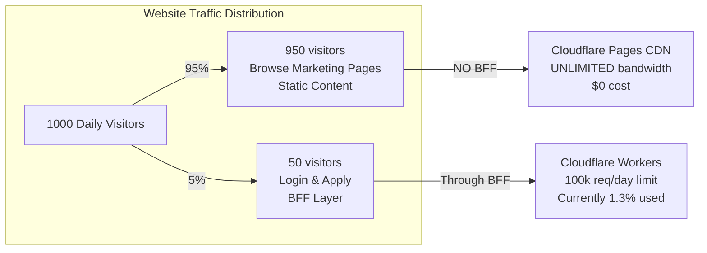

**Key Insight:**
- **Marketing pages** (programs, about, contact): Unlimited traffic, $0 cost, NO BFF
- **Application portal** (login, submit, status): Only active applicants, goes through BFF
- **Estimated 95%+ of traffic** doesn't touch BFF at all

### Verdict for 300 Registrants + 5 Admins

✅ **You're using only 1.3% of the free tier**
✅ **98.7% buffer for traffic spikes**
✅ **Even 10x growth keeps you under 15% usage**
✅ **Zero cost risk - hard limits prevent overages**
✅ **Could scale to 3,000 users and still be at 11.5%**

**Conclusion: No need to worry about BFF traffic limits for your use case.**

---

## DDoS Protection & Cost Safety

### Cloudflare Protection Features

| Feature | Free Tier Limit | Behavior on Excess | Cost Risk |
|---------|----------------|-------------------|-----------|
| **Bandwidth** | Unlimited | N/A | **$0** |
| **Requests** | 100,000/day | Blocked (HTTP 429) | **$0** |
| **Workers Execution** | 100k req/day | Blocked | **$0** |
| **DDoS Protection** | Included | Automatic filtering | **$0** |
| **Bot Detection** | Included | Automatic blocking | **$0** |

### Cost Safety Summary
- ✅ **Maximum DDoS cost: $0** (hard limits prevent overages)
- ✅ VPS protected behind Cloudflare proxy
- ✅ No surprise bills
- ✅ Automatic rate limiting
- ✅ World-class DDoS protection (Cloudflare's core business)

### Comparison with Other Platforms

| Platform | DDoS Risk | Hard Limits | Max Cost on Attack |
|----------|-----------|-------------|-------------------|
| **Cloudflare Pages + Workers** | ✅ VERY LOW | ✅ Yes | **$0** |
| **Vercel (Free)** | ⚠️ HIGH | ❌ No | **$500+** |
| **Netlify (Free)** | ✅ LOW | ✅ Yes | $0 (stops) |

---

## Security Considerations

### Implemented Security Measures

- ✅ **HttpOnly Cookies** - XSS-resistant token storage
- ✅ **HTTPS Enforced** - All connections encrypted
- ✅ **Rate Limiting** - Prevent brute force attacks
- ✅ **Password Hashing** - bcrypt with salt rounds
- ✅ **JWT Expiration** - 7-day token lifetime
- ✅ **Email Domain Validation** - Staff role enforcement
- ✅ **CORS Configuration** - Restricted origins
- ✅ **Input Validation** - express-validator on all inputs
- ✅ **DDoS Protection** - Cloudflare edge filtering
- ✅ **Bot Detection** - Automatic bot blocking
- ✅ **SQL Injection Prevention** - Parameterized queries

### Security Headers (Express.js)

```javascript
const helmet = require('helmet');

app.use(helmet({
  contentSecurityPolicy: {
    directives: {
      defaultSrc: ["'self'"],
      styleSrc: ["'self'", "'unsafe-inline'"],
      scriptSrc: ["'self'"],
      imgSrc: ["'self'", "data:", "https:"],
    }
  },
  hsts: {
    maxAge: 31536000,
    includeSubDomains: true,
    preload: true
  }
}));
```

### Rate Limiting Strategy

**Cloudflare Workers (BFF):**
```javascript
// Per-IP rate limiting
const rateLimiter = {
  limit: 10,           // 10 requests
  window: 60,          // per 60 seconds
};
```

**Express.js Backend:**
```javascript
const rateLimit = require('express-rate-limit');

const authLimiter = rateLimit({
  windowMs: 15 * 60 * 1000, // 15 minutes
  max: 5,                    // 5 attempts
  message: 'Too many login attempts'
});

app.use('/auth/login', authLimiter);
```

---

## Scalability

### Current Capacity (300 registrants, <5,000 users)

| Component | Capacity | Bottleneck |
|-----------|----------|------------|
| **Cloudflare Pages** | Unlimited | None |
| **Cloudflare Workers** | 100k req/day | ✅ Sufficient |
| **VPS (2GB RAM)** | ~5k users | CPU/Memory |
| **PostgreSQL** | 50k+ rows | None |

### Scaling Strategy

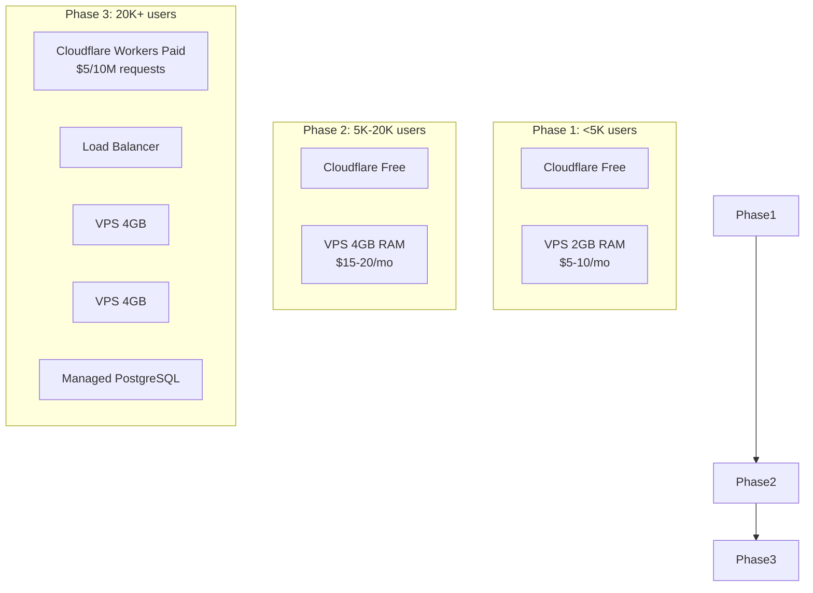

**Scaling Options:**
1. **Vertical Scaling:** Upgrade VPS (2GB → 4GB → 8GB)
2. **Horizontal Scaling:** Add load balancer + multiple VPS instances
3. **Database Scaling:** Move to managed PostgreSQL with replication
4. **Workers Scaling:** Upgrade to Cloudflare Workers Paid ($5/10M requests)

### Performance Optimization Strategies

**Caching:**
- Static assets: Aggressive caching via CDN
- API responses: Cache in Cloudflare Workers KV
- Database queries: Redis for frequently accessed data

**Database Optimization:**
- Indexes on frequently queried fields (user_id, email, status)
- Connection pooling
- Query optimization
- Periodic VACUUM operations

**Frontend Optimization:**
- Static site generation
- Image optimization
- Code splitting
- Service Worker for offline support

---

## Key Benefits

### Cost-Effective
- **$5-10/month total** for <5,000 users
- No hidden fees
- Predictable costs

### DDoS-Proof
- Hard limits prevent cost overruns
- **Maximum attack cost: $0**
- Automatic traffic filtering

### Secure
- Industry-standard authentication (OIDC)
- HttpOnly cookies prevent XSS
- Rate limiting prevents abuse

### Scalable
- Static site scales infinitely via CDN
- Backend can scale vertically or horizontally
- Database can migrate to managed service

### Developer-Friendly
- Modern tech stack (Astro, Express.js)
- Git-based workflow
- Easy local development

### SEO-Optimized
- Static site generation for marketing pages
- Fast page loads
- Excellent Core Web Vitals

### Low Maintenance
- Cloudflare handles edge layer
- Minimal operational overhead
- Automated deployments

---

## Contributors

**Architecture Design:** 2025
**Version:** 1.0
**Last Updated:** 2025-11-19
