# Dokumentasi Fitur Aplikasi Penerimaan Mahasiswa Baru

Dokumen ini menjelaskan fitur-fitur aplikasi sistem penerimaan mahasiswa baru STMIK Tazkia yang berbasis CRM (Customer Relationship Management) untuk mendukung kegiatan sales dan marketing.

---

## Alur Keseluruhan Proses

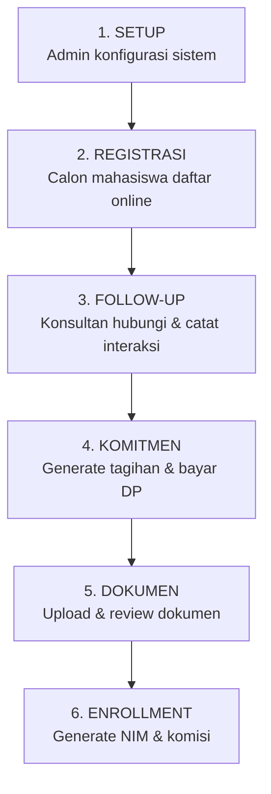
```mermaid
flowchart TD
    A[1. SETUP<br/>Admin konfigurasi sistem] --> B[2. REGISTRASI<br/>Calon mahasiswa daftar online]
    B --> C[3. FOLLOW-UP<br/>Konsultan hubungi & catat interaksi]
    C --> D[4. KOMITMEN<br/>Generate tagihan & bayar DP]
    D --> E[5. DOKUMEN<br/>Upload & review dokumen]
    E --> F[6. ENROLLMENT<br/>Generate NIM & komisi]
```

### Detail Setiap Fase

**1. SETUP (Admin)**
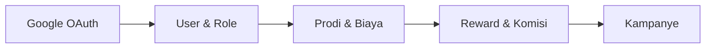
```mermaid
flowchart LR
    A1[Google OAuth] --> A2[User & Role]
    A2 --> A3[Prodi & Biaya]
    A3 --> A4[Reward & Komisi]
    A4 --> A5[Kampanye]
```

**2. REGISTRASI (Calon Mahasiswa)**
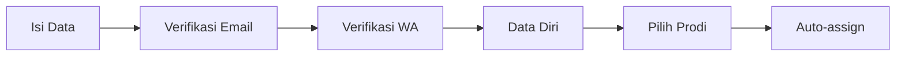
```mermaid
flowchart LR
    B1[Isi Data] --> B2[Verifikasi Email]
    B2 --> B3[Verifikasi WA]
    B3 --> B4[Data Diri]
    B4 --> B5[Pilih Prodi]
    B5 --> B6[Auto-assign]
```

**3. FOLLOW-UP (Konsultan)**
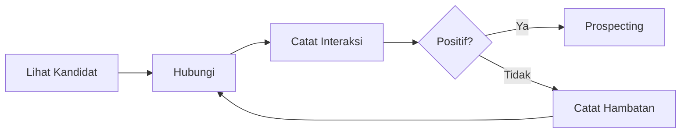
```mermaid
flowchart LR
    C1[Lihat Kandidat] --> C2[Hubungi]
    C2 --> C3[Catat Interaksi]
    C3 --> C4{Positif?}
    C4 -->|Ya| C5[Prospecting]
    C4 -->|Tidak| C6[Catat Hambatan]
    C6 --> C2
```

**4. KOMITMEN (Admin)**
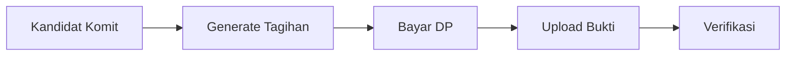
```mermaid
flowchart LR
    D1[Kandidat Komit] --> D2[Generate Tagihan]
    D2 --> D3[Bayar DP]
    D3 --> D4[Upload Bukti]
    D4 --> D5[Verifikasi]
```

**5. DOKUMEN (Calon Mahasiswa)**
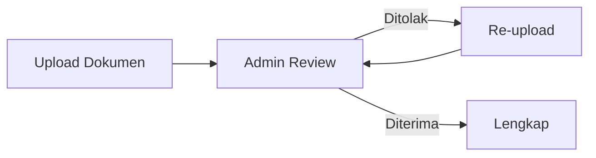
```mermaid
flowchart LR
    E1[Upload Dokumen] --> E2[Admin Review]
    E2 -->|Ditolak| E3[Re-upload]
    E3 --> E2
    E2 -->|Diterima| E4[Lengkap]
```

**6. ENROLLMENT (Admin)**
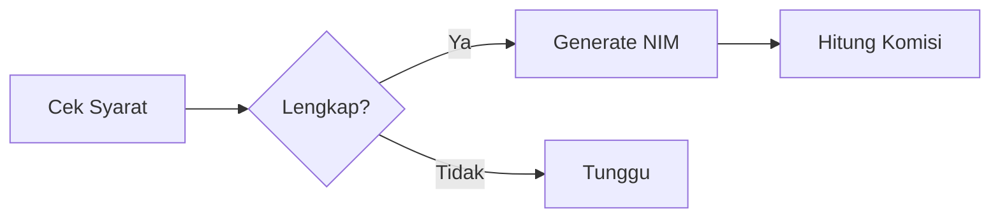
```mermaid
flowchart LR
    F1[Cek Syarat] --> F2{Lengkap?}
    F2 -->|Ya| F3[Generate NIM]
    F2 -->|Tidak| F4[Tunggu]
    F3 --> F5[Hitung Komisi]
```

---

## Role Pengguna

### 1. Admin
- Akses penuh ke seluruh sistem
- Konfigurasi prodi, biaya, kampanye, reward
- Kelola user dan role
- Verifikasi pembayaran dan dokumen
- Proses enrollment dan generate NIM
- Akses semua laporan

### 2. Supervisor
- Melihat kandidat tim yang dipimpinnya
- Memberikan saran/suggestion pada interaksi konsultan
- Melihat performa konsultan dalam timnya
- Realokasi kandidat antar konsultan
- Kelola kategori interaksi dan hambatan

### 3. Konsultan (Academic Consultant / Sales)
- Melihat kandidat yang di-assign kepadanya
- Menghubungi dan follow-up kandidat
- Mencatat setiap interaksi (telepon, WA, kunjungan)
- Melihat saran dari supervisor
- Melihat dashboard performa pribadi

### 4. Calon Mahasiswa (Kandidat)
- Mendaftar dan membuat akun
- Login ke portal kandidat
- Upload dokumen persyaratan
- Melihat status pendaftaran
- Melihat tagihan dan upload bukti bayar
- Melihat pengumuman
- Referral teman (setelah enrolled)

---

## Fase 1: Setup Admin

Sebelum membuka pendaftaran, admin harus mengkonfigurasi sistem.

### 1.1 Kelola User & Role

Admin mengelola akun staff yang bisa login ke sistem.

| Field | Keterangan |
|-------|------------|
| Email | Email institusi (@tazkia.ac.id) |
| Nama | Nama lengkap |
| Role | admin / supervisor / konsultan |
| Supervisor | (untuk konsultan) siapa atasannya |
| Status | Aktif / Nonaktif |

**Catatan:** Staff login menggunakan Google OAuth dengan email institusi. Jika email valid, akun otomatis dibuat dengan role=konsultan.

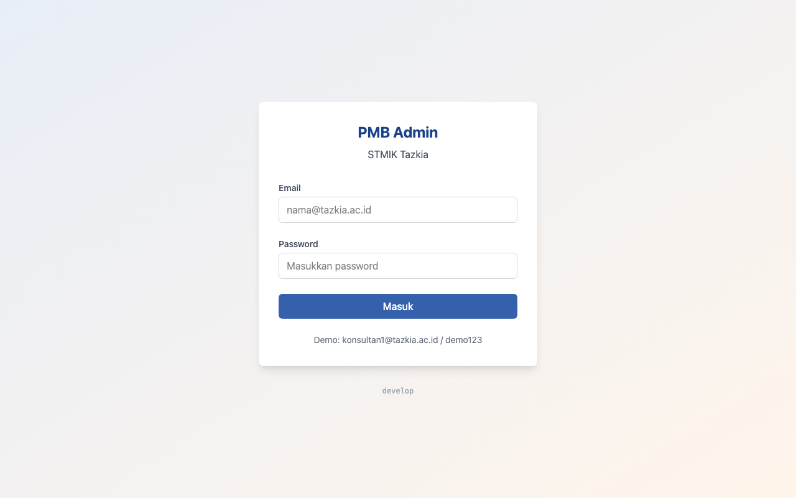

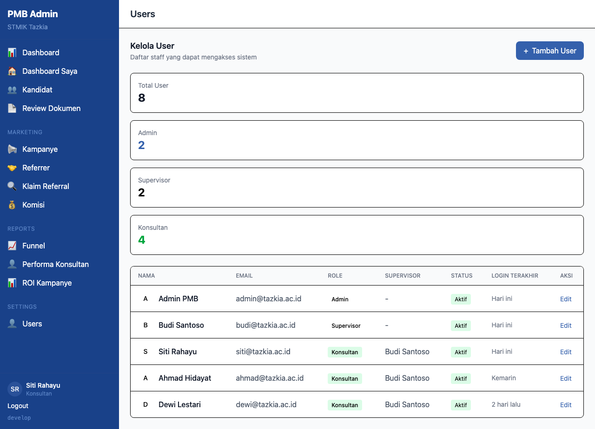

### 1.2 Setting Program Studi (Prodi)

| Field | Keterangan |
|-------|------------|
| Nama | Nama program studi |
| Kode | Kode singkat (SI, TI, dll) |
| Jenjang | S1 / D3 |
| Status | Aktif / Nonaktif |

### 1.3 Setting Jenis Biaya

Sistem mendukung 3 jenis biaya:

| Jenis Biaya | Recurring | Opsi Cicilan |
|-------------|-----------|--------------|
| Pendaftaran | Tidak | 1x bayar |
| SPP/Kuliah | Ya (per semester) | 1x bayar |
| Asrama | Ya (per semester) | 1x, 2x, atau 10x |

### 1.4 Setting Struktur Biaya

Tentukan nominal biaya per prodi dan tahun akademik.

| Field | Keterangan |
|-------|------------|
| Jenis Biaya | Pendaftaran / SPP / Asrama |
| Prodi | (opsional, untuk SPP) |
| Tahun Akademik | 2025/2026, dst |
| Nominal | Rp xxx.xxx |

**Contoh:**
- Biaya Pendaftaran: Rp 500.000 (semua prodi)
- SPP Sistem Informasi: Rp 7.500.000/semester
- SPP Teknik Informatika: Rp 8.000.000/semester
- Asrama: Rp 12.000.000/semester

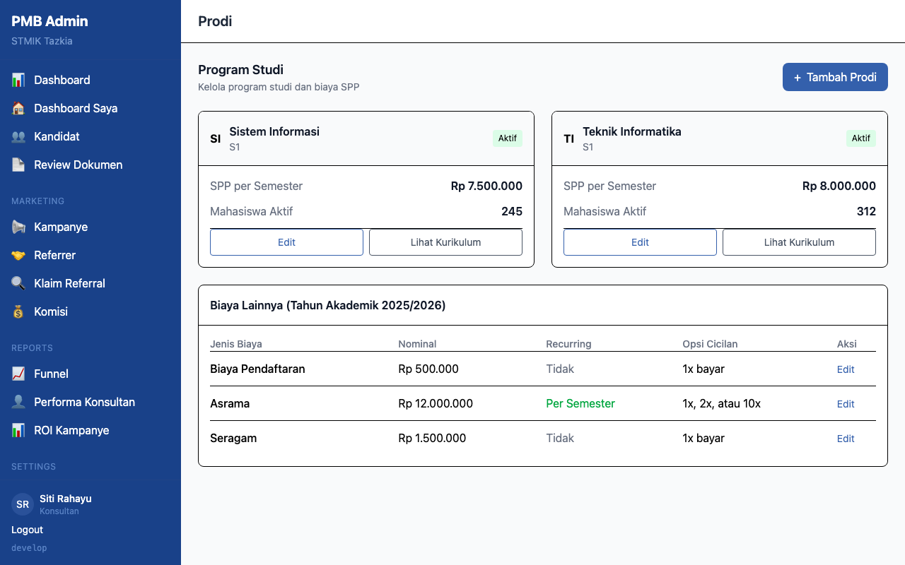

### 1.5 Setting Reward & Komisi

#### Reward untuk Referrer External

Konfigurasi default reward berdasarkan tipe referrer:

| Tipe Referrer | Reward Default | Tipe Reward | Trigger |
|---------------|----------------|-------------|---------|
| Alumni | Rp 500.000 | Cash | Enrollment |
| Guru | Rp 750.000 | Cash | Enrollment |
| Siswa | Rp 300.000 | Cash | Enrollment |
| Partner | Rp 1.000.000 | Cash | Enrollment |
| Staff | Rp 250.000 | Cash | Enrollment |

**Catatan:** Reward per referrer bisa di-override jika ada kesepakatan khusus.

#### Reward untuk Member Get Member (MGM)

Mahasiswa aktif yang mereferensikan calon mahasiswa baru:

| Field | Keterangan |
|-------|------------|
| Reward Referrer | Rp 200.000 (untuk mahasiswa yang mereferensikan) |
| Diskon Referee | 10% potongan SPP (untuk pendaftar baru) |
| Trigger | Saat referee enrolled |

### 1.6 Setting Kampanye

Kampanye digunakan untuk tracking sumber leads dan promo khusus.

| Field | Keterangan |
|-------|------------|
| Nama | Nama kampanye (misal: "Promo Lebaran 2025") |
| Tipe | promo / event / ads |
| Channel | instagram, google, expo, school_visit, dll |
| Periode | Tanggal mulai - selesai |
| Override Biaya Daftar | (opsional) Rp 0 untuk gratis, atau nominal lain |

**Contoh Kampanye:**
- "Promo Early Bird" - biaya pendaftaran Rp 0
- "Education Expo Jakarta" - tracking peserta expo
- "Instagram Ads Q1" - tracking dari iklan IG

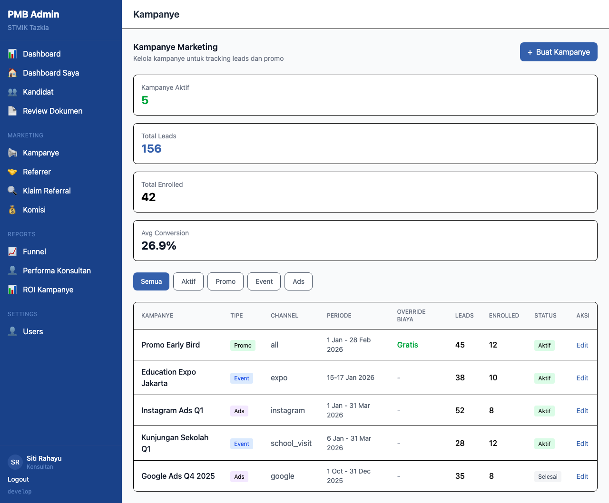

### 1.7 Setting Referrer

Daftarkan referrer yang akan mendapat komisi.

| Field | Keterangan |
|-------|------------|
| Nama | Nama referrer |
| Tipe | alumni / guru / siswa / partner / staff |
| Institusi | Asal sekolah/instansi (untuk matching klaim) |
| Kontak | Telepon, email (opsional) |
| Kode Referral | (opsional) untuk link tracking |
| Bank | Nama bank, no rekening, nama pemilik |
| Override Komisi | (opsional) jika berbeda dari default |

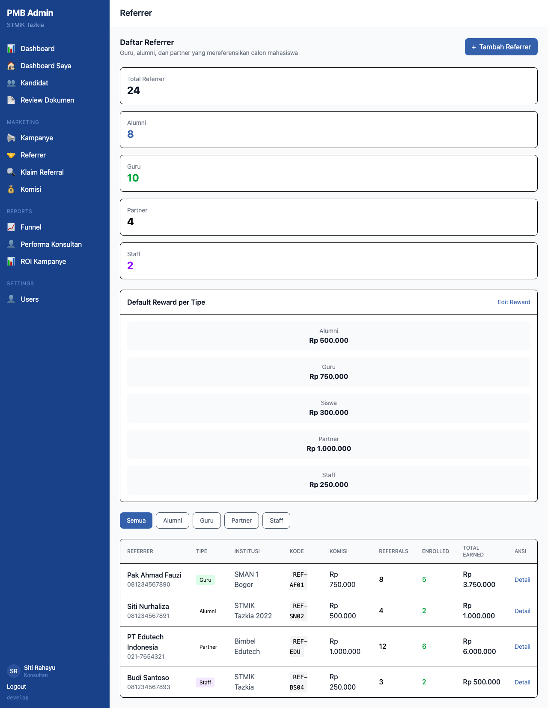

### 1.8 Setting Algoritma Assignment

Pilih bagaimana kandidat baru di-assign ke konsultan:

| Algoritma | Keterangan |
|-----------|------------|
| Round Robin | Bergantian sesuai urutan |
| Load Balanced | Berdasarkan jumlah kandidat aktif |
| Performance Weighted | Berdasarkan performa konversi |
| Activity Based | Berdasarkan aktivitas follow-up |

**Catatan:** Supervisor bisa realokasi kandidat secara manual setelah auto-assign.

### 1.9 Setting Jenis Dokumen

| Dokumen | Wajib | Bisa Ditunda |
|---------|-------|--------------|
| KTP | Ya | Tidak |
| Foto | Ya | Tidak |
| Ijazah | Ya | Ya (menyusul) |
| Transkrip | Ya | Ya (menyusul) |

### 1.10 Setting Kategori Interaksi & Hambatan

**Kategori Interaksi:**
- Tertarik (positif)
- Mempertimbangkan (netral)
- Ragu-ragu (netral)
- Dingin (negatif)
- Tidak bisa dihubungi (negatif)

**Hambatan Umum:**
- Biaya terlalu mahal
- Lokasi jauh
- Orang tua belum setuju
- Waktu belum tepat
- Memilih kampus lain

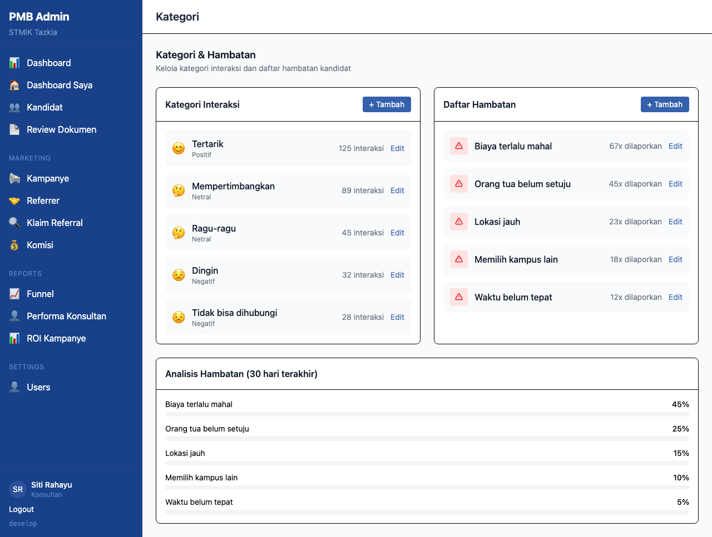

---

## Fase 2: Pendaftaran Calon Mahasiswa

### 2.1 Alur Pendaftaran

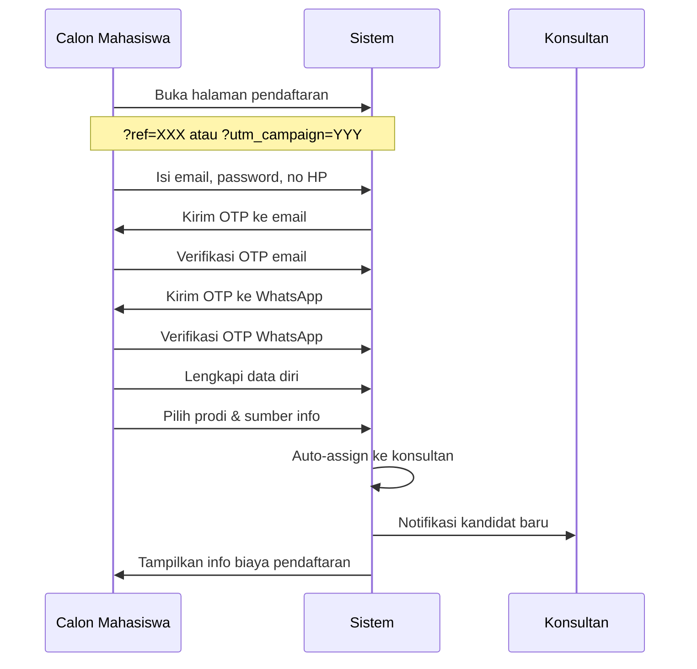
```mermaid
sequenceDiagram
    participant C as Calon Mahasiswa
    participant S as Sistem
    participant K as Konsultan

    C->>S: Buka halaman pendaftaran
    Note over C,S: ?ref=XXX atau ?utm_campaign=YYY
    C->>S: Isi email, password, no HP
    S->>C: Kirim OTP ke email
    C->>S: Verifikasi OTP email
    S->>C: Kirim OTP ke WhatsApp
    C->>S: Verifikasi OTP WhatsApp
    C->>S: Lengkapi data diri
    C->>S: Pilih prodi & sumber info
    S->>S: Auto-assign ke konsultan
    S->>K: Notifikasi kandidat baru
    S->>C: Tampilkan info biaya pendaftaran
```

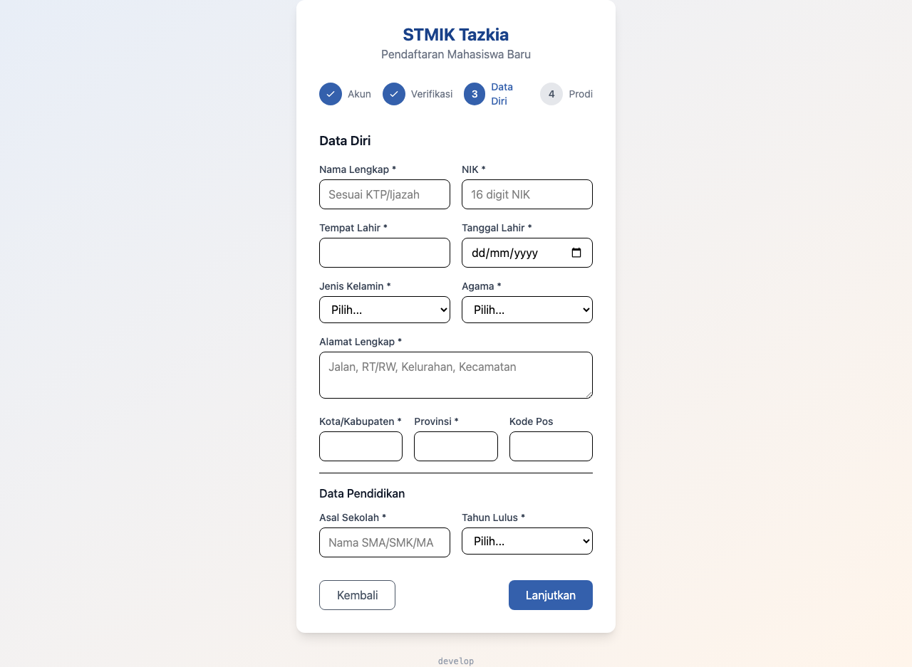

### 2.2 Tracking Sumber Pendaftaran

Sistem mencatat dari mana kandidat mengetahui STMIK Tazkia:

| Sumber | Keterangan |
|--------|------------|
| Instagram | Dari konten/iklan Instagram |
| Google | Dari pencarian Google |
| TikTok | Dari konten TikTok |
| YouTube | Dari video YouTube |
| Expo | Dari pameran pendidikan |
| Kunjungan Sekolah | Dari sosialisasi ke sekolah |
| Teman/Keluarga | Direferensikan teman/keluarga |
| Guru/Alumni | Direferensikan guru/alumni |
| Walk-in | Datang langsung |
| Lainnya | Sumber lain |

**Jika memilih "Teman/Keluarga" atau "Guru/Alumni":**
Kandidat diminta mengisi nama referrer. Admin akan mencocokkan dan menghubungkan ke data referrer untuk perhitungan komisi.

### 2.3 Portal Kandidat

Setelah registrasi, kandidat bisa login ke portal untuk:

1. **Dashboard** - Melihat status pendaftaran dan checklist
2. **Dokumen** - Upload/re-upload dokumen persyaratan
3. **Pembayaran** - Melihat tagihan dan upload bukti bayar
4. **Pengumuman** - Melihat info dan pengumuman terbaru
5. **Referral** - (setelah enrolled) Dapatkan kode referral untuk ajak teman

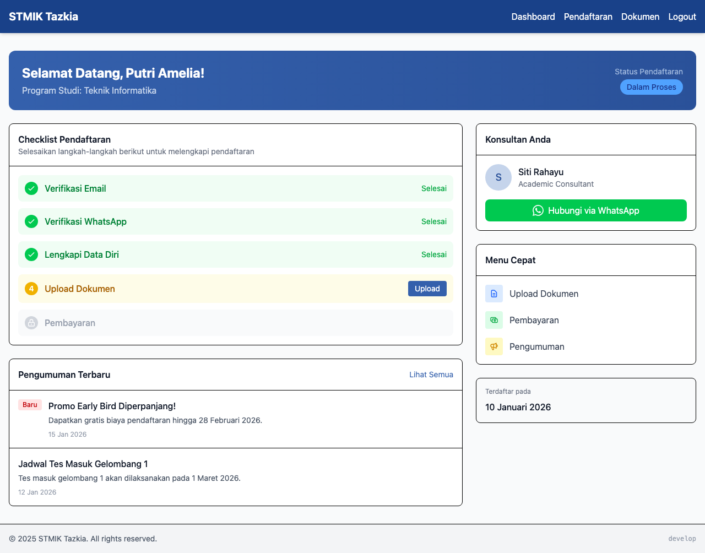

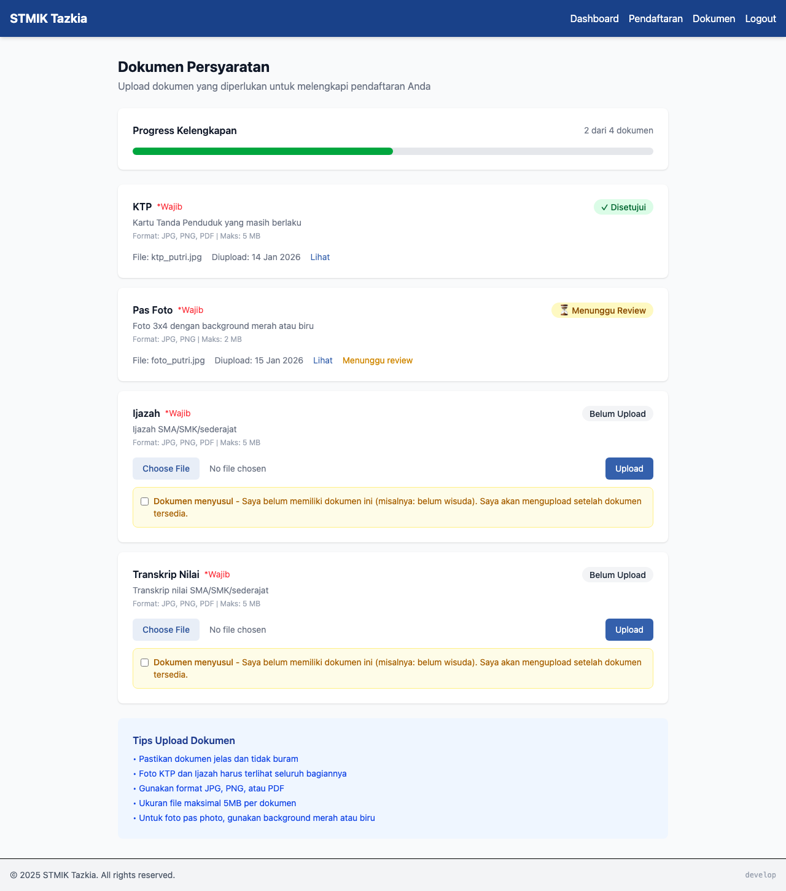

---

## Fase 3: Follow-up oleh Konsultan

### 3.1 Daftar Kandidat

Konsultan melihat daftar kandidat yang di-assign kepadanya dengan filter:

- Status: registered, prospecting, committed, enrolled, lost
- Prodi
- Sumber
- Tanggal pendaftaran
- Overdue follow-up (> 3 hari tidak dihubungi)

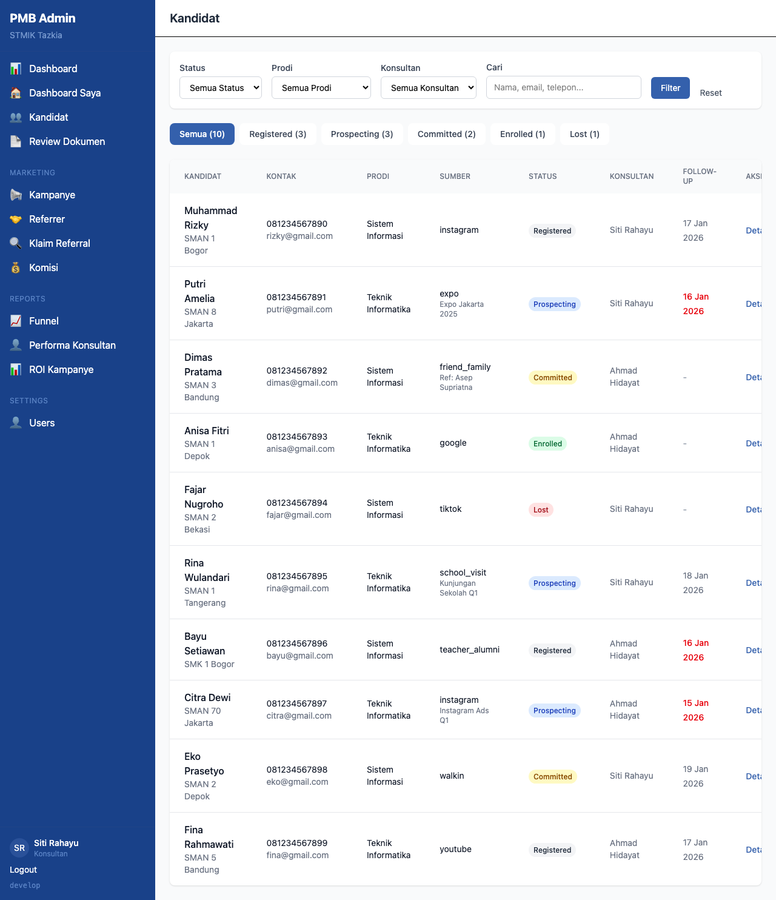

### 3.2 Detail Kandidat

Informasi yang ditampilkan:
- Data pribadi (nama, kontak, alamat)
- Data pendidikan (asal sekolah, tahun lulus)
- Prodi pilihan
- Sumber pendaftaran & kampanye
- Status pembayaran
- Status dokumen
- Timeline interaksi

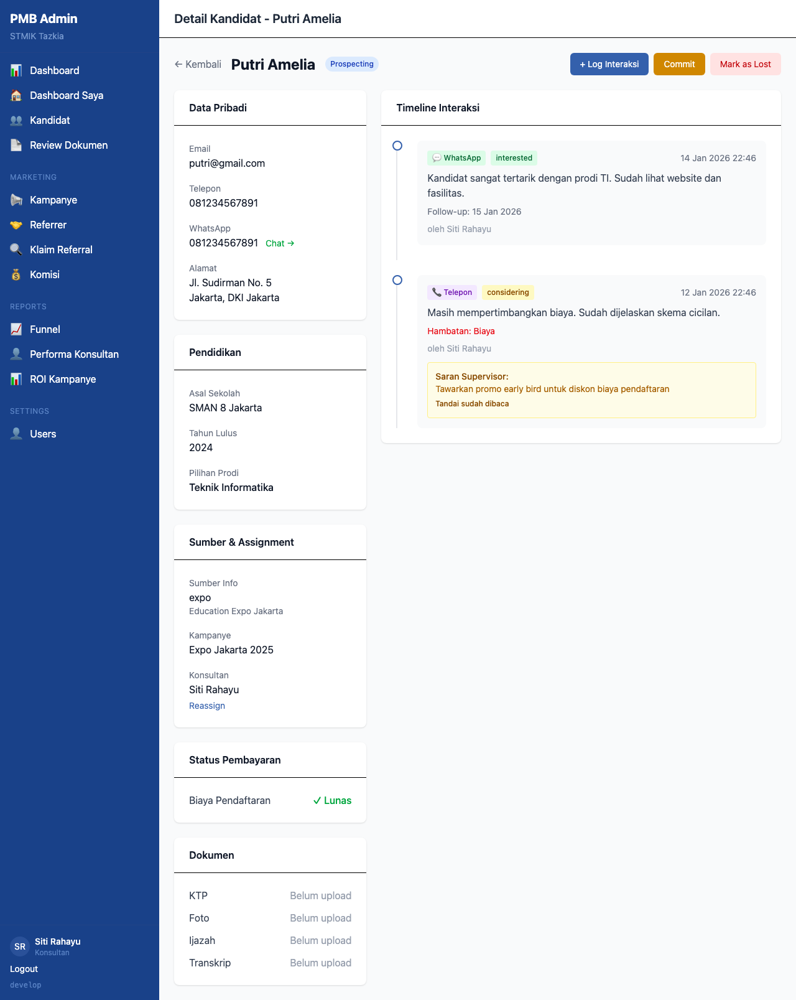

### 3.3 Pencatatan Interaksi

Setiap kontak dengan kandidat harus dicatat:

| Field | Keterangan |
|-------|------------|
| Channel | Telepon, WhatsApp, Email, Kunjungan Kampus, Kunjungan Rumah |
| Kategori | Tertarik, Mempertimbangkan, Ragu-ragu, Dingin, Tidak bisa dihubungi |
| Hambatan | (opsional) Pilih dari daftar hambatan |
| Catatan | Isi percakapan/hasil interaksi |
| Follow-up Berikutnya | Tanggal rencana follow-up selanjutnya |

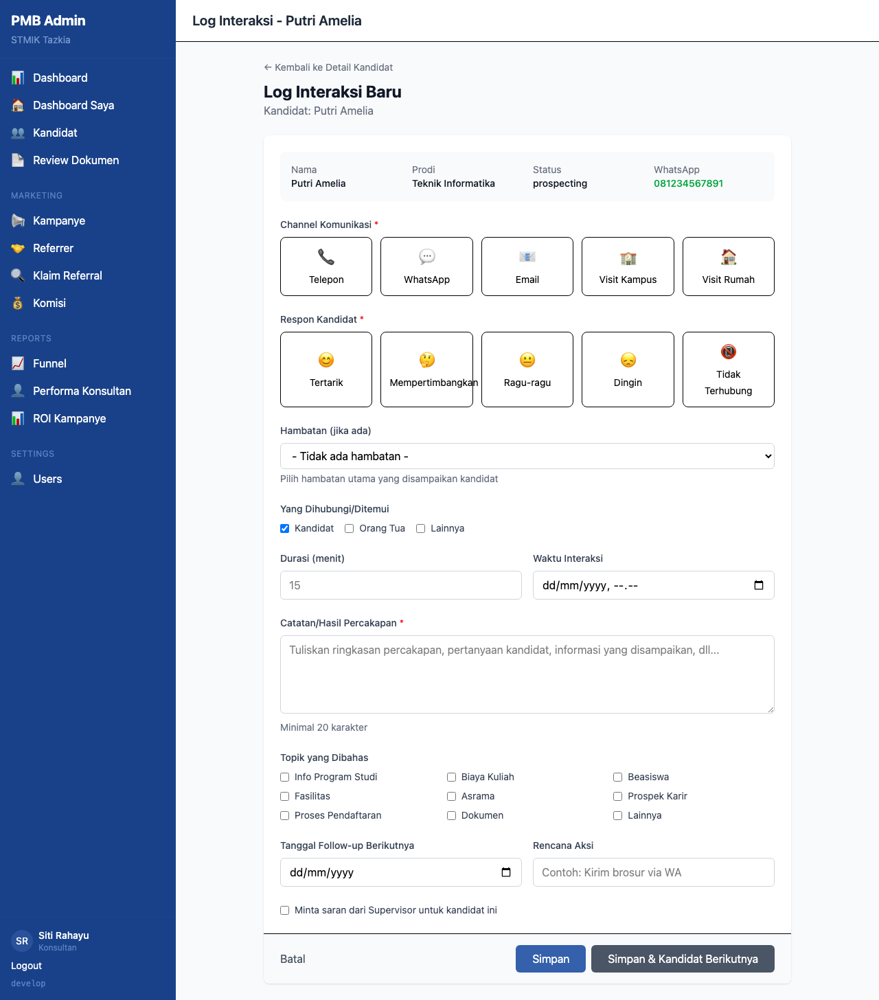

### 3.4 Saran dari Supervisor

Supervisor dapat memberikan saran pada interaksi konsultan:
- Saran muncul di timeline kandidat
- Konsultan mendapat notifikasi saran baru
- Konsultan menandai saran sudah dibaca

---

## Fase 4: Komitmen & Pembayaran

### 4.1 Proses Komitmen

Ketika kandidat menyatakan komit untuk mendaftar:

1. Admin/Konsultan mengubah status ke "Committed"
2. Sistem generate tagihan:
   - SPP semester 1 (pilih cicilan: 1x)
   - Asrama (pilih cicilan: 1x, 2x, atau 10x)
3. Kandidat melihat tagihan di portal
4. Kandidat upload bukti pembayaran
5. Admin verifikasi pembayaran

### 4.2 Skema Pembayaran

| Jenis | Cicilan | Keterangan |
|-------|---------|------------|
| Pendaftaran | 1x | Dibayar saat registrasi |
| SPP | 1x | Lunas per semester |
| Asrama | 1x | Lunas di awal |
| Asrama | 2x | 50% di awal, 50% pertengahan semester |
| Asrama | 10x | Cicilan bulanan |

### 4.3 Verifikasi Pembayaran

Admin memverifikasi bukti bayar:
- Lihat bukti transfer yang diupload
- Cocokkan nominal dan tanggal
- Approve atau reject dengan alasan
- Jika reject, kandidat bisa re-upload

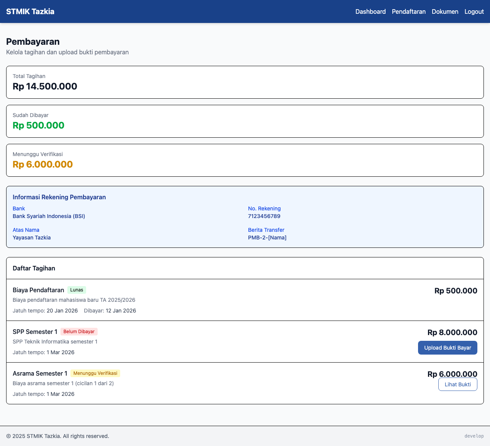

---

## Fase 5: Dokumen & Enrollment

### 5.1 Review Dokumen

Admin mereview dokumen yang diupload kandidat:
- Cek kesesuaian dan kejelasan dokumen
- Approve atau reject dengan alasan
- Kandidat bisa re-upload jika ditolak

**Dokumen yang bisa ditunda:** Ijazah dan transkrip bisa menyusul jika belum wisuda.

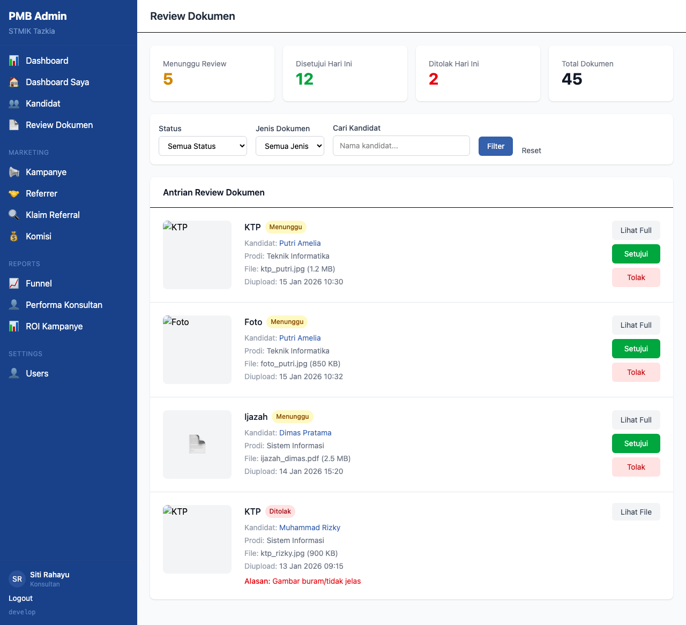

### 5.2 Syarat Enrollment

Kandidat bisa di-enroll jika memenuhi:

| Syarat | Status |
|--------|--------|
| Biaya Pendaftaran | Lunas |
| SPP Semester 1 | Minimal DP/cicilan pertama |
| KTP | Approved |
| Foto | Approved |
| Ijazah | Approved ATAU ditunda |
| Transkrip | Approved ATAU ditunda |

### 5.3 Generate NIM

Format NIM: `YYYY` + `KODE_PRODI` + `SEQUENCE`

Contoh: `2026SI001` = Tahun 2026, Prodi SI, urutan ke-1

### 5.4 Generate Kode Referral MGM

Setelah enrolled, mahasiswa mendapat kode referral unik:
- Format: `MGM-{NIM}` (contoh: `MGM-2026SI001`)
- Bisa dibagikan ke teman untuk mendaftar
- Jika teman enrolled, keduanya dapat reward

---

## Fase 6: Komisi & Reward

### 6.1 Tracking Komisi

Komisi otomatis dibuat saat kandidat yang direferensikan enrolled:

| Field | Keterangan |
|-------|------------|
| Referrer | Nama referrer |
| Kandidat | Nama kandidat yang enrolled |
| Nominal | Sesuai konfigurasi reward |
| Status | Pending → Approved → Paid |

### 6.2 Proses Pembayaran Komisi

1. Komisi otomatis masuk dengan status "Pending"
2. Admin approve komisi
3. Admin export data untuk transfer bank
4. Admin tandai sebagai "Paid"

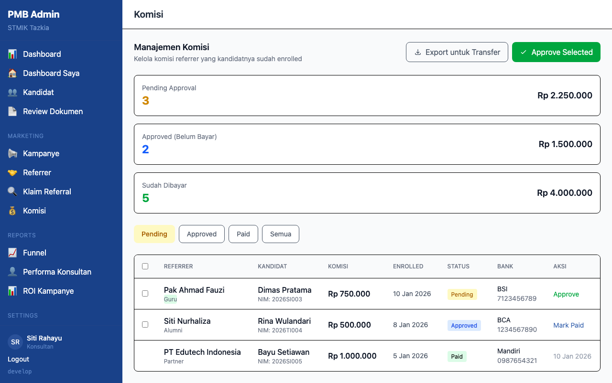

---

## Fase 7: Laporan & Analitik

### 7.1 Dashboard Konsultan

- Jumlah kandidat per status
- Kandidat overdue follow-up
- Tugas hari ini

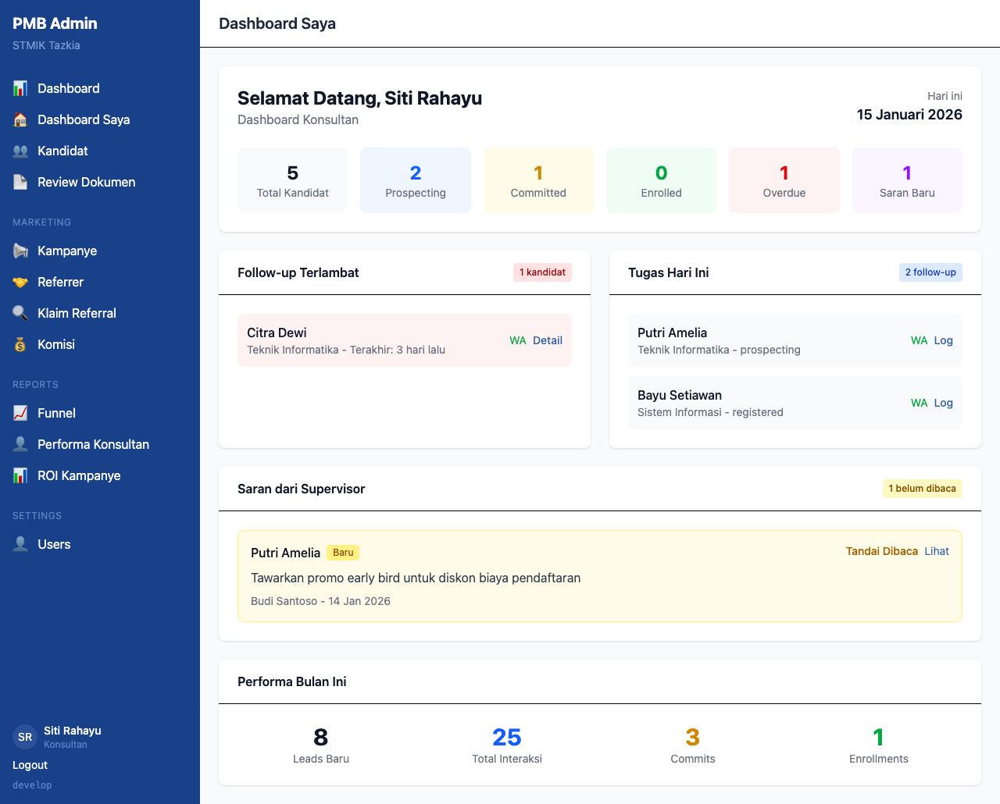

### 7.2 Dashboard Supervisor

- Funnel tim: registered → prospecting → committed → enrolled
- Leaderboard konsultan
- Kandidat stuck (> 7 hari tanpa interaksi)
- Hambatan yang sering muncul

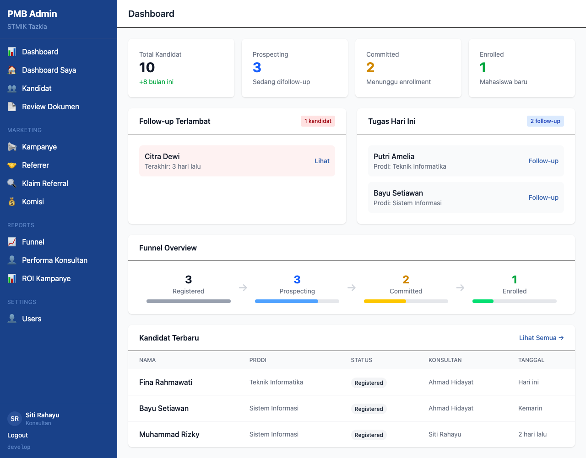

### 7.3 Laporan Funnel

Konversi per tahap:
- Registered → Prospecting: XX%
- Prospecting → Committed: XX%
- Committed → Enrolled: XX%

Filter: periode, prodi, kampanye

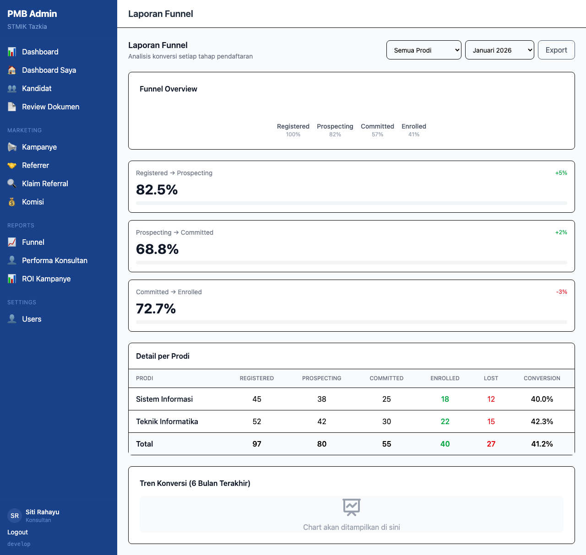

### 7.4 Laporan Performa Konsultan

- Jumlah kandidat ditangani
- Tingkat konversi
- Rata-rata waktu sampai commit
- Frekuensi interaksi

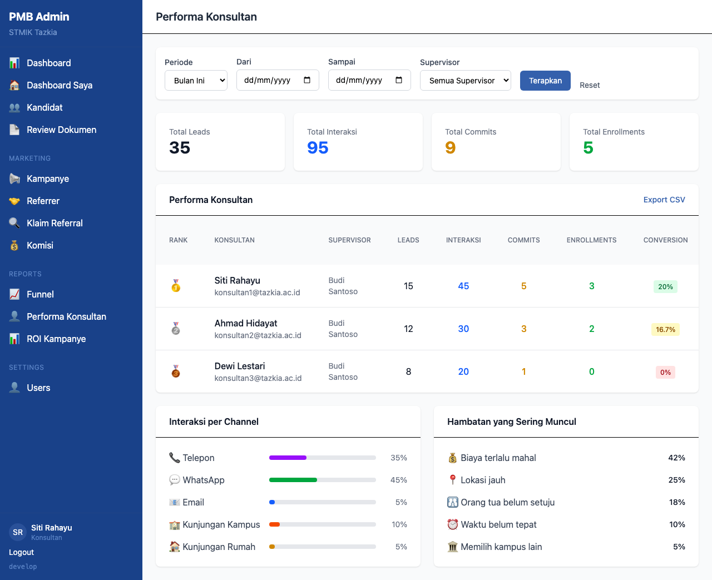

### 7.5 Laporan ROI Kampanye

- Leads per kampanye
- Commits per kampanye
- Enrollments per kampanye
- Conversion rate per kampanye

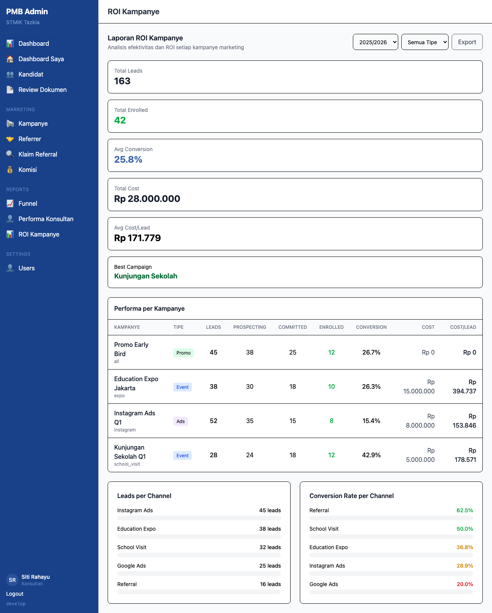

### 7.6 Laporan Referrer

- Referral per referrer
- Enrollments per referrer
- Komisi earned/paid

### 7.7 Export CSV

Export data kandidat dan interaksi untuk analisis external.

---

## Notifikasi

### WhatsApp Notification

Notifikasi otomatis dikirim ke kandidat:
- Konfirmasi pendaftaran
- Reminder pembayaran
- Reminder dokumen
- Pengumuman enrollment

---

## Ringkasan Konfigurasi yang Perlu Disiapkan

Sebelum go-live, pastikan sudah dikonfigurasi:

| Item | PIC | Keterangan |
|------|-----|------------|
| User & Role | Admin | Daftarkan semua konsultan dan supervisor |
| Prodi | Admin | Daftarkan prodi yang dibuka |
| Biaya Pendaftaran | Admin | Nominal biaya pendaftaran |
| Biaya SPP per Prodi | Admin | Nominal SPP per prodi per tahun |
| Biaya Asrama | Admin | Nominal asrama per tahun |
| Reward Referrer | Admin | Nominal komisi per tipe referrer |
| Reward MGM | Admin | Nominal reward member get member |
| Kampanye Aktif | Marketing | Kampanye promo yang sedang jalan |
| Daftar Referrer | Marketing | Guru, alumni, partner yang aktif mereferensikan |
| Algoritma Assignment | Admin | Pilih metode distribusi leads |
| Kategori & Hambatan | Supervisor | Daftar kategori interaksi dan hambatan |

---

## Catatan Teknis

- **Login Staff:** Menggunakan Google OAuth dengan email institusi
- **Login Kandidat:** Email + password yang dibuat saat registrasi
- **Verifikasi:** Email dan WhatsApp diverifikasi dengan OTP 6 digit
- **File Upload:** Dokumen dan bukti bayar disimpan di cloud storage
- **Session:** Cookie-based dengan JWT, expired 30 hari

---

*Dokumen ini dibuat untuk review tim sales marketing. Untuk detail teknis implementasi, lihat `backend/TODO.md`.*
